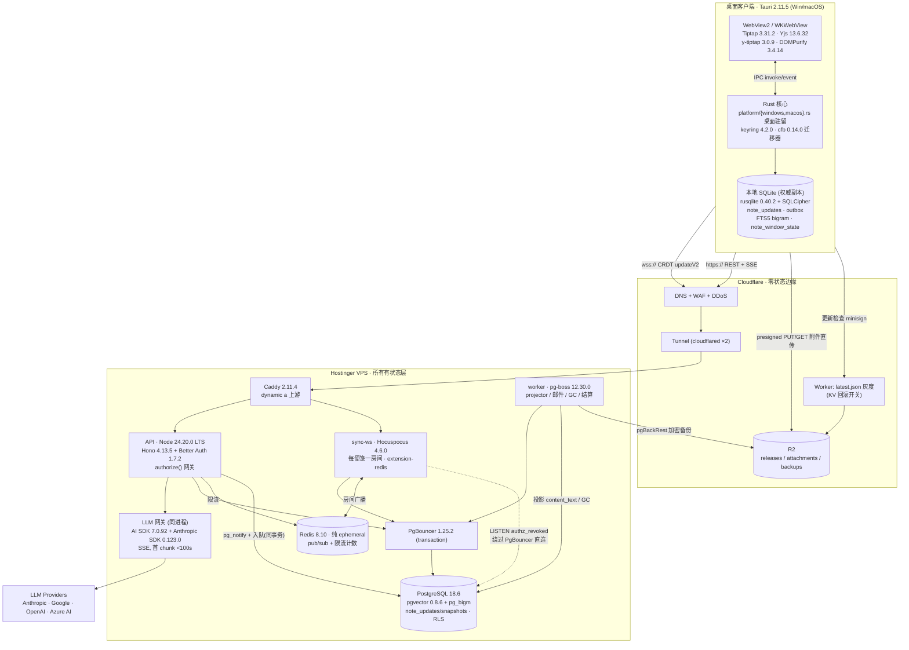
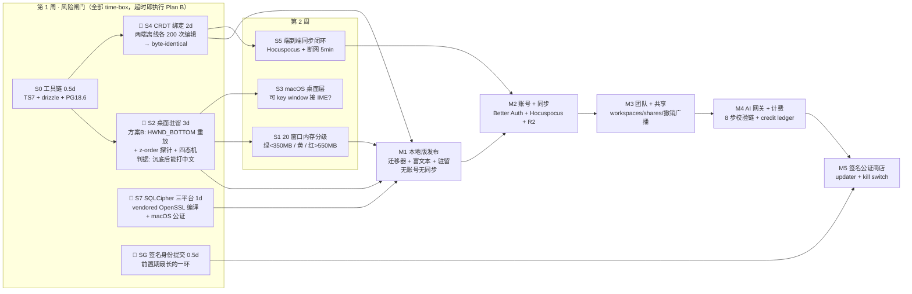

# 第 01 章 · 架构总览与跨模块裁定

> 架构总览与跨模块裁定

---

## 第 0 章：架构总览与跨模块裁定

> 本章不新增技术内容，只做一件事：**把 1–10 章互相矛盾的地方裁掉，把没人管的接缝补上，然后给出一张全局图。** 凡本章裁定与某一章正文冲突的，以本章为准，该章需回改。
>
> 核实说明：本章新做的版本核实见章末 verified_facts（crates.io / registry.npmjs.org / nodejs.org dist index，2026-09-04 实测）。定价类数字沿用各章的「未核实」标注，不在此处洗白。

---

### 0.1 三条全局公理

18 条冲突里有 11 条是同一个根因的不同表现：**没人先定客户端框架和后端语言**。先定这三条，大部分冲突自动消解。

| # | 公理 | 论据 | 被推翻的章节 |
|---|---|---|---|
| **A1** | 客户端 = **Tauri 2.11.5**，无 Electron | 第 2 章的窗口层级论证成立且不可替代；Rust 在编译链内是「桌面驻留」的前提 | 第 1 章全部 Electron API |
| **A2** | 服务端 = **Node 24.20.0 LTS (Krypton) + TypeScript**，Rust 只存在于客户端 | Better Auth 1.7.2、Hocuspocus 4.6.0、pg-boss 12.30.0、AI SDK 7.0.92 四个核心依赖全部 Node-only。选 Rust 后端 = 这四个全部自研或跑边车 | 第 4/6/7 章的「后端语言待定」 |
| **A3** | **有状态层 100% 在 Hostinger VPS，Cloudflare 零状态** | LISTEN/NOTIFY、WebSocket 房间、连接池、pg-boss 都无法在 Workers isolate 里成立 | 直接回答需求 5 |

A2 的连带硬约束：**Node ≥ 22.12.0**（pg-boss 12.30.0 的 `engines`）。选 24.20.0 而非 22.x，因为 24 是 Active LTS、22 已进入 Maintenance。

**A1 的代价必须现在还清** —— 第 1 章的 P0 清单要逐条改写：

| 第 1 章（Electron） | Tauri 等价物 | 备注 |
|---|---|---|
| `frame: false` | `decorations: false` | — |
| `-webkit-app-region: drag` | `data-tauri-drag-region`（bare 值） | v2 已内置排除 contenteditable/input |
| `skipTaskbar: true` | `skip_taskbar: true` | macOS 无此概念，改 `ActivationPolicy::Accessory` |
| `screen.getAllDisplays()` | `available_monitors()` | 返回 Physical，第 2 章已定死不用 Logical |
| `setAlwaysOnTop(true,'floating')` | `set_always_on_top(true)` + macOS 补 `collectionBehavior` | 见 2.4 |
| `requestSingleInstanceLock` | `tauri-plugin-single-instance` 2.4.4 | — |
| `better-sqlite3@13.0.3` | `rusqlite 0.40.2` + SQLCipher | native 重编译矩阵问题一并消失 |
| **`cfb@1.2.2`（npm，2022 起停更）** | **`cfb` crate 0.14.0（2026-02-13）** | 已核实：mdsteele/rust-cfb，5842 万次下载，`.snt` 解析的技术债直接归零 |

最后一行是本次整合的意外收获：第 1 章为 `cfb@1.2.2` 停更写了一整条风险和「自己 fork 或手写 CFBF（2 人天）」的预案，切到 Tauri 后这条风险和这 2 人天**同时消失**。

---

### 0.2 决策冲突裁定表

| # | 冲突 | 裁定 | 理由（一句话） |
|---|---|---|---|
| C1 | 客户端框架：Electron(1) vs Tauri(2) | **Tauri** | 见 A1 |
| C2 | 同步传输：HTTP 增量(3) vs WebSocket(4/6/8/9) | **WebSocket，Hocuspocus 4.6.0** | 第 3 章「省 60% 服务端工作量」的前提是自研；但第 4 章自己估自研同步层 18–22 天/4000 行，而 Hocuspocus 是装包 + 写 4 个 hook。**HTTP 方案更贵，不是更便宜** |
| C3 | 后端语言未定(4/6/7) | **Node 24.20.0 + TS** | 见 A2 |
| C4 | 贴桌面：砍掉(1) vs z-order 沉底(2) vs WorkerW SetParent(10 的 S2) | **第 2 章方案 B** | `SetParent` 到 WorkerW 使窗口变 `WS_CHILD`，收不到键盘与 IME —— 一个不能打字的便笺不是便笺。第 10 章 S2 的成功判据必须整条重写 |
| C5 | 客户端中文检索：FTS5 trigram(1/7) vs bigram shingling(3) | **bigram shingling + unicode61** | trigram 对「会议」「报销」恒 0 命中，第 1 章自己承认并加了 LIKE 旁路 —— 那是两条代码路径。bigram 一条路径覆盖 ≥2 字，仅 1 字查询走 LIKE |
| C6 | 服务端中文检索：PGroonga 4.0.8(3) vs pg_bigm(8) | **pg_bigm** | 两者都要自建镜像，但 PGroonga 拖进整个 Groonga 原生引擎并锁死 PG 大版本升级窗口。便笺量级用不上它的检索质量优势。PGroonga 留作 v2 逃生口，接口限定在 `searchNotes()` 一个函数内 |
| C7 | PostgreSQL：16.13(6) / 17(10) / 18.6(3/8) | **18.6** | 第 3 章的 `uuidv7()` 内置是硬需求（PG18 起）。第 6 章 DDL 需在 18.6 重跑，第 10 章 drizzle 兼容性验证目标改 18 |
| C8 | 队列：pg-boss 12.30.0(6) vs BullMQ/Redis(8) | **pg-boss** | 业务写与入队同事务，根治「邀请写进库了但邮件没发」。**连带**：Redis 不再持有持久数据，第 8 章的 `maxmemory-policy=noeviction` 硬要求解除，改回 `allkeys-lru` |
| C9 | 组织表：Better Auth `organization` 插件(5) vs 第 6 章自建 DDL | **Better Auth 表为权威**，业务列用 `additionalFields` 挂到同一张表 | 两套 org 表 = 两个真源。`plan / seats_paid / stripe_* / allow_public_links / session_epoch / seat_billable` 全部作为 additionalFields；`workspaces / shares / note_pins / notifications / audit_log` 仍自建 |
| C10 | 附件 GC：ref_count(3) vs mark-and-sweep(4) | **mark-and-sweep** | CRDT 的删除是 tombstone 且可被 undo 复活，引用计数在这里必然漏减或多减 |
| C11 | credit 单位：1 credit ≡ $0.0005(7) vs $0.001(10) | **$0.001**，并统一定价 | 第 10 章的推导含支付手续费后的净收入，模型更完整。见 0.2.1 |
| C12 | AI 成本基线：gemini-3.8-flash(7) vs Haiku 4.5(10) | **registry 默认仍是 gemini-3.8-flash，配额按 claude-haiku-4-5 ($1/$5) 计算** | Haiku 单价可核实且更贵，按它算配额 = 保守方向；Gemini 真便宜只会让毛利更好，两章结论同时成立 |
| C13 | E2EE × 服务端 AI × 版本历史(9 已裁 / 10 还在问) | **保险箱内笔记：禁用托管 AI（仅 BYOK 客户端直连）、禁用服务端版本历史与服务端检索** | 第 9 章已裁定，第 10 章的 open question 就此关闭，不再重开 |
| C14 | 窗口位置：本地 `note_window_state`(2) vs 服务端 `note_pins(x,y,w,h,monitor_id)`(6) | **拆分**：位置永远本地权威，`note_pins` 删掉 x/y/w/h/monitor_id，只留 `(user_id, note_id, pinned_at, always_on_top)` | 跨设备同步窗口坐标在异分辨率下是负价值 |
| C15 | AI 写入的 transaction origin(3/4) | **一律本地 origin，在客户端 `transact` 内落地** | 否则第 4 章的远端变更高亮会在每次 AI 改写时误触发 |

#### 0.2.1 C11 的统一数字

```
1 credit ≡ $0.001 上游成本（priceIn/priceOut 自动推导，调价即时生效，无需发版）
Pro：$4.99/月（中国区 ¥25）→ MoR 抽约 7% → 净 $4.64
     AI COGS 上限 = 净收入 18% = $0.83 → 800 credits/月
Free：50 credits/月（$0.05）+ 每日 ≤5 次 + 必须登录 + 全平台月度熔断 $500
```
按 Haiku 4.5 的 $0.0028/次算，Pro 800 credits ≈ 285 次改写/月，Free 50 credits ≈ 17 次。两者都在第 7 章与第 10 章各自的安全区内。

---

### 0.3 接缝地带：谁也没管的六件事

**S1 — 附件全链路**（横跨 3/4/6/8/9 章，五章各管一段，没人串起来）：

```
1. 客户端 Rust spawn_blocking 算 BLAKE3-256 → content_hash
2. POST /v1/attachments/presign {workspace_id, hash, size, mime}
   命中 → 直接返回 attachment_id（去重，不上传）
   未命中 → 返回 R2 presigned PUT（15 min）
3. 客户端直传 R2（绝不经 VPS —— KVM2 的 100 GB 撑不过 2000 用户）
4. POST /v1/attachments/commit 确认
5. Y.Doc 只存 attachment_id，image node attrs = {attachmentId, w, h, blurhash}
6. 渲染时用 attachment_id 换 5 min GET 签名 URL，签发前必须过
   authorize(user, note_id, 'viewer')  ← 权限来自引用它的 note，不在 blob 上
7. GC：projector 把 content JSONB 里的 attachment_ids 投影到 attachment_refs
   表，pg-boss 周任务 anti-join 扫 last_referenced_at + 30d
```
**E2EE 例外**：保险箱笔记的附件在客户端用该笔记 DEK 做 XChaCha20-Poly1305 加密后再上传，`content_hash` 取**密文**的 hash —— 因此 **E2EE 附件不参与去重**。用明文 hash 会构成跨 workspace 存在性泄露，这是第 3 章去重设计里唯一没被 E2EE 章覆盖的洞。

**S2 — 一次 AI 调用的完整校验链**（横跨 5/6/7/9 章，四章各写了一段中间件，没人给顺序）：

```ts
// apps/api/src/ai/pipeline.ts —— 顺序不可调换
1. authenticate()                         // 第5章 bearer/DPoP
2. withOrgTx(orgId)                       // SET LOCAL app.user_id（必须在显式事务内）
3. authorize(user, noteId, 'editor')      // 第6章 effective_note_permission
4. aiGate(org.ai_enabled, user.ai_opt_in) // 第9章三级开关，需穷举测试
5. assertNotVault(noteId)                 // 第9章 C13：保险箱笔记在此 403
6. creditGuard(orgId, userId)             // 第7章 org 池 + 每 member 日上限 + 全局熔断
7. route(capabilities ∩ task)             // 第7章：按能力交集，不按 tier
   → SSE，首 chunk < 100s（哪怕 `: ping`），否则 Cloudflare 524
8. ledger.write({upstream_request_id, service_tier, ...})  // 取消也要记已产生 output
```
第 5 步是新增的：没有它，用户可以对一条保险箱便笺调 AI，服务端就拿到了明文 —— 整个 E2EE 承诺当场作废。

**S3 — LISTEN/NOTIFY 必须绕过 PgBouncer**：第 6 章要 `pg_notify('authz_revoked')` + WS 网关 LISTEN，第 8 章说 PgBouncer transaction 模式下 LISTEN 不可用。裁定：Hocuspocus 进程持有 **1 条绕过 PgBouncer 的直连**专供 LISTEN，其余全部走 PgBouncer 1.25.2。同时 drizzle-orm + node-postgres 在 transaction pooling 下必须禁用 prepared statements。

**S4 — Rust 侧的 Y.Doc 禁区**：第 4 章的 `OffsetKind::Utf16` 地雷只在**构造 `Doc`** 时存在。裁定：客户端 Rust 只允许 `yrs::alt::merge_updates_v2` / `diff_updates_v2`（不构造 Doc，不涉及 offset），Yjs 语义全在 WebView 的 JS 侧。任何构造 Doc 的代码必须显式 `Options{ offset_kind: OffsetKind::Utf16 }`，用 clippy `disallowed-methods` 强制。这样这颗静默地雷在 v1 根本不会被踩到。

**S5 — R2 需要第三把 key**：第 8 章只签发了 `releases`（只写）和 `backups`（只写 + 对象锁定）。附件桶漏了。补 `bianfa-attachments`：读写权限，仅供 API 进程签发 presigned URL，绝不下发到客户端。

**S6 — Sentry 与便笺正文**：第 9 章指出默认配置会把局部变量与 breadcrumb 一起上报，第 4 章还在问「是否上报遥测」。裁定：`sendDefaultPii: false` + `includeLocalVariables: false` + `beforeSend` 白名单，遥测默认开启但只上报第 4 章的 `shrink_guard_tripped` 等 6 个计数器，**永不上报任何 note 内容字段**，隐私政策明列。

---

### 0.4 统一系统架构图



数据流三条主线：**(1) 编辑** WebView → Y.Doc → 本地 update log（先落盘）→ outbox → wss → Hocuspocus → `note_updates` append-only → pg-boss projector 写 `content_text` 只读投影；**(2) 附件** 客户端 ↔ R2 直传，VPS 只签 URL 不过流量；**(3) AI** 客户端 → API（8 步校验链）→ SSE 流式 → 客户端本地 `transact` 落地，服务端永不回写 Y.Doc。

---

### 0.5 统一技术栈总表

| 层次 | 选型 | 版本 | 理由 |
|---|---|---|---|
| 桌面壳 | Tauri | 2.11.5（pin `=2.11.5`） | 多窗口内存 + native 在编译链内；`with_webview` 要求 pin minor |
| 编辑器 | Tiptap / ProseMirror | 3.31.2 | 唯一成熟的 headless 富文本 + CRDT 绑定生态 |
| CRDT | Yjs / yrs | 13.6.32 / 0.27.4 | 纯 JS 62 KB gzip（Loro/Automerge 为 1 MB+ WASM） |
| CRDT 绑定 | @tiptap/y-tiptap | 3.0.9 | y-prosemirror 停在 2025-07；三包 peerDep 锁死同版 |
| 本地存储 | rusqlite + SQLCipher | 0.40.2 | `bundled-sqlcipher-vendored-openssl,load_extension` |
| 本地检索 | FTS5 + 应用层 bigram | SQLite 内置 | 零扩展、零编译、零公证审查；2 字中文可命中 |
| 客户端密钥 | keyring | 4.2.0 | 三平台后端在 default feature 内（不是 3.x） |
| `.snt` 解析 | cfb (crate) | 0.14.0 | 替代停更的 npm `cfb@1.2.2` |
| 后端运行时 | Node LTS "Krypton" | 24.20.0 | pg-boss 要 ≥22.12.0；22.x 已 Maintenance |
| HTTP 框架 | Hono | 4.13.5 | 轻量、边缘/Node 同构 |
| 认证 | Better Auth（自托管） | 1.7.2 | 零 MAU 计费；user 表可与 note JOIN |
| 同步服务 | Hocuspocus (+extension-redis) | 4.6.0 | 官方 Yjs 服务端，与主包同步发版 |
| 队列 | pg-boss | 12.30.0 | 与业务写同事务 |
| 数据库 | PostgreSQL | 18.6 | 内置 `uuidv7()` |
| PG 扩展 | pgvector / pg_bigm | 0.8.6 / 支持 PG18 | 语义检索 + 中文 bigram GIN |
| 连接池 | PgBouncer | 1.25.2 (transaction) | LISTEN 走旁路直连 |
| 缓存/广播 | Redis | 8.10-alpine（`allkeys-lru`） | 无持久数据后可放宽驱逐策略 |
| ORM | drizzle-orm | 0.45.2（Kysely 逃生口） | 5 个月未更新是黄灯，M0 期 20 min 验证 |
| LLM SDK | AI SDK / Anthropic SDK | 7.0.92 / 0.123.0（pin） | 四家走 AI SDK，Anthropic 一家例外直连 |
| 反代 | Caddy | 2.11.4（`dynamic a`） | 静态 upstream 只解析一次 DNS |
| 边缘 | Cloudflare DNS/WAF/R2/Tunnel | — | 零状态；100 MB 安装包走 R2 是合规路径 |
| 前端构建 | Vite / TypeScript / pnpm / Vitest | 8.2.2 / 7.0.2 / 11.25.0 / 4.1.11 | Vitest 不上刚发布一天的 5.0.0 |

---

### 0.6 从零到发布的关键路径



**必须在第 1 周验证掉的五个风险，以及它们为什么不能推迟：**

1. **S2 桌面驻留**（🔴 最高）—— 这是产品唯一的差异点，也是唯一没有跨平台抽象层的部分。第 10 章说得对：砍掉它拿到的留存信号无决策价值。但它的方案必须是第 2 章的 z-order 沉底而非 WorkerW SetParent。**3 天做不出可打字的沉底窗口 → 降级为「三档置顶 + Win+D 豁免」，官网文案不再出现「贴在桌面」**。
2. **S4 CRDT 绑定 + Y.Doc 结构冻结** —— 冻结 `body=XmlFragment / meta=Y.Map / ext=Y.Map` 三行约定。这是全项目返工成本最高的决策，且 M2 之后改动等于全量数据迁移。
3. **S7 SQLCipher 三平台编译** —— vendored OpenSSL 静态链接会同时踩 Windows 构建时长、macOS 公证对静态库的处理两个坑。第 9 章明确警告「临近发版引入会直接导致延期」。
4. **SG 代码签名身份提交** —— 第 8 章判断正确：这是整条发布链上前置期最长的一环，且卡在「公司还是个人主体」这个非技术问题上。第 1 周只需提交材料，不需要跑通签名。
5. **updater minisign 私钥的两处离线备份** —— 不是 spike，是纪律。这是全项目唯一不可恢复的单点故障，必须在第一次发版**之前**完成备份并写进交接文档；配套的 kill switch 第二公钥同时生成。

不在第 1 周的两个：S1（窗口内存）依赖 S2 的窗口实现，S3（macOS 桌面层）工作量只有 Windows 的 1/5 且有明确降级路径（`.floating` 浮窗），可以等。

**M1 的范围就此锁死**：本地便笺 CRUD + 富文本 5 项 + 7 色 + 多显示器位置 + 桌面驻留 + plum.sqlite 迁移器 + bigram 本地搜索 + 回收站 30 天。**不含**账号、同步、团队、AI —— 这四样全在 M2 之后，因为它们共享同一条「authorize() 网关 + RLS」地基，拆开做会做两遍。
