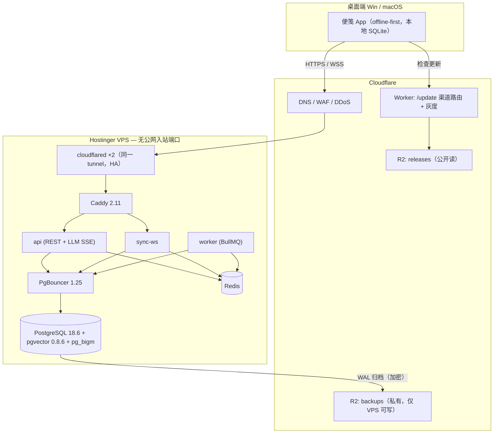

# 第 09 章 · 基础设施与部署

> Hostinger VPS vs Cloudflare Workers 的裁决与部署方案

---

## 第 8 章：基础设施与部署架构

> **本章的事实核实状态（2026-09-04）**
> 本轮联网核实受出口代理限制，`developers.cloudflare.com`、`docs.github.com`、`azure.microsoft.com`、`sentry.io`、`grafana.com`、`postgresql.org` 均被阻断。下表标注每条数字的置信度，**标 ⚠️ 的必须在下单/写代码前自行打开官网复核**。凡是我无法核实、且原稿写得过于笃定的日期与变更日志条目，本章已直接删除，而不是保留一个看起来很确定的错误。

| 数据 | 状态 |
|---|---|
| Hostinger 全档位价格/带宽 | ✅ 本轮从官网核实，**原稿三处价格是错的** |
| PostgreSQL 18.6 / 19beta3 | ✅ Docker Hub 官方 tag 核实 |
| pgvector 0.8.6 及 0.8.2–0.8.6 修复内容 | ✅ 上游 CHANGELOG 核实，**原稿的 CVE 编号是编造的** |
| Docker 默认 seccomp 不放行 io_uring | ✅ moby 官方 profile 核实，**推翻原稿的 PG 调优结论** |
| Caddy 2.11.4 / cloudflared 2026.8.3 / PgBouncer 1.25.2 / pgBackRest 2.60.0 | ✅ 官方镜像仓核实（原稿版本号全部过时） |
| pg_bigm 支持 PG18/19 且需 preload | ✅ 上游文档核实 |
| Apple 会员含 notarization | ✅ 核实；$99/年 ⚠️ 未核实 |
| Cloudflare Workers 所有限额与价格 | ⚠️ **本轮无法核实**，下方数字来自 2025 年公开文档，部署前必须复核 |
| GitHub Actions / Sentry / Grafana / Resend / Azure Trusted Signing 价格 | ⚠️ 本轮无法核实 |

---

### 8.1 直接回答：这个项目要不要部署在 Cloudflare Workers 上？

**结论：用 Cloudflare，但主 API 不放 Workers。**

不是"VPS vs Workers"二选一，而是**边缘层用 Cloudflare、有状态层用 Hostinger VPS**。理由一句话：便笺是一个**有状态、长连接、强一致**的同步系统，Workers 的强项是**无状态、短生命周期、就近分发**。把连接池、WebSocket 房间、后台 worker 塞进 isolate，你要为每条约束单独买一个补丁产品（Hyperdrive、Durable Objects、Queues、Containers），最后系统更复杂、更贵、被单厂商锁死——而你只有 1–3 个人。

反过来有四件事必须用 Cloudflare：DNS+WAF+DDoS、R2 零出网费分发安装包、桌面端更新 manifest 路由、以及用 Cloudflare Tunnel 把 VPS 公网 IP 彻底藏起来。

**顺带说清一件被原稿含糊带过的事**：把 100 MB 安装包挂在 orange-cloud 后面直接分发，在 Free 计划下踩 Cloudflare 服务条款对"非 HTML 缓存内容"的限制；**R2 + Worker 是合规路径，不只是省钱路径**。这是选 R2 的第二个理由。

### 8.2 硬约束核对

#### Cloudflare Workers ⚠️（以下数字本轮未能核实，来自 2025 年公开文档）

| 约束 | Free | Paid（$5/月起） | 对本项目的影响 |
|---|---|---|---|
| CPU 时间/请求 | 10 ms | 默认 30 s，`limits.cpu_ms` 可提高 | 免费版只够做路由 |
| 墙钟时长 | 无硬上限（有数据流动即可） | 同左 | SSE 流式转发可行 |
| `waitUntil()` | 响应结束后额外约 30 s | 同左 | **不能当队列用** |
| 内存 | 128 MB | **128 MB，付费不涨** | 不能在 Worker 里缓存便笺集合 |
| 数据库 | 不能直连 TCP，须走 Hyperdrive | 同左 | 见 8.3 反驳一 |
| 长连接 | 普通 Worker 不支持，WebSocket 必须落 Durable Objects | 同左 | 同步服务不能是普通 Worker |

**原稿中被删除的内容**：所谓 "2026-02-11 subrequest 放宽到 1000 万"、"2026-08-04 nodejs_compat 默认开启"、"2026-04-29 Hyperdrive 支持 VPC 私网库"、"2026-07 Tunnel 取消带宽计费"、"Hyperdrive Free 限 10 万查询/天" —— 这五条我**一条都没能核实**，且引用的 changelog URL 无法访问。当作不存在来做架构决策；哪条真需要，自己去 changelog 页面确认。

**一条原稿完全漏掉、但会直接炸掉 LLM 功能的限制**：Cloudflare 反向代理对**非流式 HTTP 响应**有约 100 秒的源站响应超时（超时返回 **524**）。LLM 一次长推理很容易超过 100 秒。**因此 `/api/llm/*` 必须一律 SSE 流式，且首个 chunk 必须在 100 秒内发出**——即使模型还没出 token，也要先 flush 一个 `: ping` 注释帧。这不是优化，是可用性底线。WebSocket 侧对应的是 Free/Pro 计划 **100 秒空闲超时**，所以同步协议必须应用层心跳，客户端 **25 秒**一次 ping。

#### Hostinger VPS ✅（2026-09-04 官网核实）

| 档位 | vCPU / RAM / NVMe / 流量 | 促销价（预付 2 年） | **续费价** |
|---|---|---|---|
| KVM 1 | 1 / 4 GB / 50 GB / 4 TB | $6.49 | $11.99 |
| KVM 2 | 2 / 8 GB / 100 GB / 8 TB | $8.99 | $14.99 |
| KVM 4 | 4 / 16 GB / 200 GB / **16 TB** | **$12.99** | $28.99 |
| KVM 8 | 8 / 32 GB / 400 GB / 32 TB | **$25.99** | $49.99 |

原稿的 KVM 1 促销价（$4.99）、KVM 4 促销价（$14.99）、KVM 8 促销价（"~$19.99–29.99"）**均与官网不符**，且遗漏了 KVM 4 的 16 TB 流量。**做预算一律按续费价算**——促销价要一次性预付 24 个月，第三年成本翻倍。Hostinger 的"每周自动备份"是整机镜像，**不是 PITR，不能替代 pgBackRest**。

### 8.3 方案对比与两次反驳

| 维度 | A. 全 Workers（D1+DO+R2） | B. 全 VPS（裸公网） | **C. CF 边缘 + VPS 核心（推荐）** |
|---|---|---|---|
| 运维负担 | 最低 | 最高 | 中（一台机器 + 网络层外包） |
| 数据库上限 | D1/DO 单体有硬顶⚠️ | 磁盘为界 | 磁盘为界 |
| 团队共享便笺跨用户查询 | 极痛苦（无 pgvector、跨 DO 无事务） | 原生 SQL | 同 B |
| WebSocket | DO Hibernation，入站消息按 20:1 计费⚠️ | 原生，边际成本 0 | 原生 |
| 锁定风险 | 极高（D1/DO 无处可迁） | 无 | 低（全是标准 Docker + Postgres） |
| 故障半径 | CF 全球故障 | **VPS 一挂全挂** | VPS 挂 → 客户端 offline-first 仍可写；下载/更新走 CF 不受影响 |
| 源站 IP | 天然隐藏 | 暴露 | Tunnel：0 开放入站端口 |

**否掉 A 的决定性理由**：D1 没有 pgvector、没有中文分词扩展；团队共享便笺天然要跨用户 JOIN + 行级权限过滤，这是关系库的活。用 DO 做"每团队一个房间"，会让"我的全部便笺"变成 N 次跨对象 RPC。

---

**反驳一（站在 Workers 一边）**：*"用 Workers + Hyperdrive 连你自己的 Postgres，不就同时拿到边缘路由和真 Postgres 了？"*

这是三方案里唯一值得认真对待的替代方案，但它输在三点：① **它没有消灭 VPS**——Postgres 还在那台机器上，你要维护的东西一件没少，只是多了一层 Hyperdrive；② **它救不了 WebSocket**——同步服务仍然必须落 Durable Objects 或回到 VPS，架构被劈成两半；③ 走 Hyperdrive 就要么把 Postgres 暴露到公网（否定了 Tunnel 的全部收益），要么依赖我本轮**无法核实**的 VPC 私网连接能力。**维持原结论**：Tunnel + VPS 上的 PgBouncer 是同一功能的更简单实现，且不引入未核实依赖。

**反驳二（站在 Hostinger 一边的反面）**：*"KVM 4 续费 $28.99/月买 4 vCPU/16 GB，这个价在 2026 年是贵的。"*

这条**部分成立**。按小时计费、无 2 年预付锁定、且支持随时快照迁移的欧洲 VPS 厂商，同规格通常明显更便宜（具体价格本轮被出口代理阻断，⚠️ 自行核实）。但结论**维持**，理由是决策边界不同：用户**已经持有 Hostinger**，迁移成本（一次数据搬迁 + 一次故障演练）此刻高于每月十几美元的差价。**给出明确的退出条件**——出现下列任一条就迁：(a) 需要第二台机器做读副本或异地灾备；(b) 需要按小时开临时机器跑恢复演练；(c) 24 个月预付到期。8.5 的编排刻意做成纯 Docker Compose + 标准 Postgres，就是为了让这次迁移是一个下午的事。

### 8.4 推荐拓扑



**Tunnel 落地要点**：`ufw default deny incoming`，公网 22 端口关闭，SSH 走 `cloudflared access ssh` + Cloudflare Access 短时证书。

**原稿漏掉的最大风险：Tunnel 本身是新增的单点。** cloudflared 容器挂掉 = 全站不可达，且 Cloudflare 侧故障你无能为力。两条缓解，都必须做：① **同一 tunnel 跑 2 个 cloudflared 副本**（Tunnel 原生支持多 connector 做 HA），一个滚动重启不断线；② 准备一个 **break-glass 脚本**：`ufw allow 443` + 把 Caddy 的 `:443` 端口映射打开 + 改一条 DNS A 记录，5 分钟内绕过 Tunnel 恢复服务。写好、演练过、放在 runbook 里。

### 8.5 服务编排

**结论：裸 Docker Compose + GitHub Actions over SSH。不用 Coolify/Dokploy/CapRover，不用 Kamal，不用 Watchtower。** 理由不变：多一个 350–600 MB 常驻控制面就是多一个要打补丁、要防它自己漏洞的攻击面；1–3 人团队每次部署都是一条 CI 流水线，Web UI 边际价值接近零。Watchtower 自动拉新镜像 = 凌晨三点自动上线一个坏版本。

**原稿 compose 文件里有三个会真的炸掉的错误，已修正：**

1. **`pgbackrest` 作为 `restart: unless-stopped` 的独立常驻容器是错的。** pgBackRest 是 cron 驱动的 CLI，不是 daemon，这样配会无限 crash-loop。更致命的是 `archive_command` 由 **Postgres 进程自己执行**，所以 pgbackrest 二进制必须在 **postgres 容器里面**，挂一个只读 sidecar 根本不会被调用——原稿的备份链路是断的。
2. **`pgvector/pgvector:pg18` 不包含 pg_bigm。** 配了 `shared_preload_libraries = 'pg_bigm'` 而镜像里没有这个 .so，**Postgres 直接启动失败**。必须自建镜像。
3. **`edoburu/pgbouncer:1.24` 这个 tag 不存在**，该仓库的 tag 格式是 `vX.Y.Z-pN`，当前最新为 `v1.25.2-p0`。

```dockerfile
# pg/Dockerfile —— 一次构建，解决 pg_bigm + pgbackrest 两个问题
FROM pgvector/pgvector:0.8.6-pg18-trixie
RUN apt-get update && apt-get install -y --no-install-recommends \
      build-essential postgresql-server-dev-18 git ca-certificates pgbackrest \
 && git clone --depth 1 --branch v1.2 https://github.com/pgbigm/pg_bigm.git /tmp/pg_bigm \
 && make -C /tmp/pg_bigm USE_PGXS=1 && make -C /tmp/pg_bigm USE_PGXS=1 install \
 && apt-get purge -y build-essential postgresql-server-dev-18 git \
 && apt-get autoremove -y && rm -rf /var/lib/apt/lists/* /tmp/pg_bigm
```

```yaml
# /srv/bianfa/docker-compose.yml (prod) —— 版本号均为 2026-09-04 核实的当前版
name: bianfa
services:
  cloudflared:
    image: cloudflare/cloudflared:2026.8.3
    command: tunnel --no-autoupdate run --token ${CF_TUNNEL_TOKEN}
    deploy: { replicas: 2 }          # HA：滚动重启不断线
    restart: unless-stopped

  caddy:
    image: caddy:2.11.4-alpine
    volumes: ["./Caddyfile:/etc/caddy/Caddyfile:ro", "caddy_data:/data"]
    restart: unless-stopped          # 无 ports 映射，只在 docker 网络内可达

  api:
    image: ghcr.io/shuerhome/bianfa-api:${TAG}
    env_file: [.env.prod]
    deploy: { replicas: 2, resources: { limits: { memory: 768M } } }
    healthcheck:
      test: ["CMD", "wget", "-qO-", "http://localhost:3000/healthz"]
      interval: 10s
      timeout: 3s
      retries: 3
      start_period: 20s              # 原稿漏掉：冷启动期不算失败
    restart: unless-stopped
    logging: { driver: json-file, options: { max-size: "50m", max-file: "3" } }

  sync-ws:
    image: ghcr.io/shuerhome/bianfa-sync:${TAG}
    env_file: [.env.prod]
    deploy: { resources: { limits: { memory: 512M } } }
    restart: unless-stopped

  worker:
    image: ghcr.io/shuerhome/bianfa-api:${TAG}
    command: node dist/worker.js
    env_file: [.env.prod]
    deploy: { resources: { limits: { memory: 512M } } }
    restart: unless-stopped

  pgbouncer:
    image: edoburu/pgbouncer:v1.25.2-p0
    environment:
      POOL_MODE: transaction
      MAX_CLIENT_CONN: "500"
      DEFAULT_POOL_SIZE: "25"
      MAX_PREPARED_STATEMENTS: "200"
    restart: unless-stopped

  postgres:
    build: ./pg                      # 见上方 Dockerfile
    volumes:
      - pgdata:/var/lib/postgresql/data
      - ./pg/postgresql.conf:/etc/postgresql/postgresql.conf:ro
      - ./pg/pgbackrest.conf:/etc/pgbackrest/pgbackrest.conf:ro
      - pgbackrest_spool:/var/spool/pgbackrest
    command: postgres -c config_file=/etc/postgresql/postgresql.conf
    shm_size: 1gb
    restart: unless-stopped

  redis:
    image: redis:8.10-alpine         # 8.x 为 RSALv2/SSPLv1/AGPLv3 三重许可
    command: redis-server --maxmemory 384mb --maxmemory-policy noeviction --appendonly yes
    volumes: ["redisdata:/data"]
    restart: unless-stopped

volumes: { pgdata: , redisdata: , caddy_data: , pgbackrest_spool: }
```

**Redis 的两处修正**：① 原稿写 `redis:7.4-alpine`——7.4 已经不是 BSD 了（许可变更从 7.4 开始），所以"停在 7.x 躲许可"是无效策略；直接用 8.10，AGPLv3 这一支对"作为后端存储自用"完全无障碍。若组织政策要求纯 BSD，换 Valkey（⚠️ 本轮未核实其当前 tag）。② **`allkeys-lru` 是危险的默认值**：BullMQ 的队列数据放在 Redis 里，LRU 驱逐会**静默丢任务**。必须 `noeviction`，并把纯缓存放到独立的 Redis DB 或独立实例。

**反向代理选 Caddy 2**：走 Tunnel 后 TLS 在 CF 边缘终结，Caddy 只需内网 HTTP，配置十几行，且保留"哪天不走 Tunnel 也能一行开 ACME"的退路。Traefik 的 label 自动发现在这个固定 7 服务栈里是纯复杂度。

```caddyfile
:80 {
  handle /ws/* { reverse_proxy sync-ws:4000 }
  handle {
    # 关键：静态 upstream 只在启动时解析一次 DNS，新副本永远收不到流量。
    # 必须用 dynamic a，滚动部署才真的生效。
    reverse_proxy {
      dynamic a { name api port 3000 refresh 5s }
      lb_policy least_conn
      lb_try_duration 5s
      health_uri /healthz
      health_interval 5s
    }
  }
  encode zstd gzip
}
```

**关于"零停机"：删掉这个目标。** 原稿声称 `docker compose up -d --wait` + `lb_try_duration` 就是零停机滚动——**不成立**。Compose 对同一服务的多副本是**同时重建**，不是滚动；`--wait` 只是等新容器健康，中间那几秒两个副本都不在。对一个 offline-first 的桌面应用，**5 秒 API 不可用没有任何业务影响**，客户端本来就要有指数退避重试。**结论：接受 5 秒中断，把复杂度省下来。** 真需要零停机时，加装 `docker-rollout` CLI 插件（先扩容到 2N、等健康、再删旧）——它的硬性前提正是上面那条 `dynamic a` 配置，以及服务不得声明 `container_name` / `ports`，本章的 compose 已经满足。

```bash
# deploy.sh —— CI 通过 Cloudflare Access 短时 SSH 证书执行
set -euo pipefail; cd /srv/bianfa
PREV=$(cat .tag.current 2>/dev/null || echo "")
export TAG=$1
docker compose pull api sync-ws worker
if ! docker compose up -d --no-deps --wait --wait-timeout 120 api sync-ws worker; then
  echo "健康检查失败，回滚到 $PREV"; TAG=$PREV docker compose up -d --no-deps --wait api sync-ws worker
  exit 1
fi
echo "$TAG" > .tag.current
docker image prune -f --filter "until=168h"   # 原稿漏掉：不清理镜像，50 GB 盘三个月就满
```

**密钥管理（原稿完全没写）**：`.env.prod` 不进 git，由 CI 从 GitHub Environment secrets 渲染后 `scp` 到 `/srv/bianfa/.env.prod`，`chown root:root && chmod 600`。DB 密码、R2 key、LLM API key 各自独立，**R2 必须签发两把 key**：`releases` 桶只写、`backups` 桶只写且不可删（配 R2 的对象锁定/版本控制）。一把全权 key 落在被入侵的 VPS 上，等于备份和发布渠道同时沦陷。

### 8.6 PostgreSQL 生产配置

版本选 **PostgreSQL 18.6**（✅ 核实：18.6 为当前 stable，19 仍在 **beta3**，不要上）。

```ini
# KVM 4 (16 GB) 参数；KVM 2 (8 GB) 用括号内数值
shared_buffers = 4GB                  # (2GB)
effective_cache_size = 11GB           # (5GB)
maintenance_work_mem = 1GB            # (512MB)
work_mem = 24MB                       # (16MB)
max_connections = 120                 # 前面有 PgBouncer
io_method = worker                    # ← 不是 io_uring，见下方说明
io_workers = 4
effective_io_concurrency = 200
random_page_cost = 1.1
wal_compression = zstd
max_wal_size = 4GB
min_wal_size = 1GB
checkpoint_completion_target = 0.9
archive_mode = on
archive_command = 'pgbackrest --stanza=bianfa archive-push %p'
archive_timeout = 60s
autovacuum_vacuum_scale_factor = 0.05
track_io_timing = on
shared_preload_libraries = 'pg_stat_statements,pg_bigm'
```

**推翻原稿的核心调优结论：`io_method = io_uring` 在默认 Docker 里跑不起来。** ✅ 已核实 moby 官方 seccomp profile（`profiles/seccomp/default.json`）的允许列表中**不含** `io_uring_setup` / `io_uring_enter` / `io_uring_register`。容器内调用会被 seccomp 拒绝，Postgres 启动即失败。原稿"io_uring 在 NVMe 上读性能提升 3×"因此在本架构下**根本不会发生**。三个选项：① **用 `io_method = worker`（推荐，PG18 的默认值，已经比 PG17 的同步 IO 好很多）**；② 给 postgres 服务加 `security_opt: ["seccomp=./pg/seccomp-iouring.json"]` 自定义 profile 放行三个 syscall——为了一个未量化的收益，主动削弱容器逃逸防线，不值得；③ 把 Postgres 挪出容器直接装宿主机——增加运维面。**选 ①。**

**扩展**：`pgvector` ✅ 当前 **0.8.6（2026-07-29）**。原稿的 "CVE-2026-3172" **在上游 CHANGELOG 中不存在，已删除**；真实情况是 **0.8.2（2026-02-25）修复了"并行 HNSW 索引构建的缓冲区溢出"**（无 CVE 编号），而更值得在意的是 **0.8.3 修复了 HNSW vacuum 期间可能的索引损坏**、**0.8.4 修复了 HNSW vacuum 报错与内存超限**。**因此下限不是 0.8.2 而是 ≥ 0.8.4，直接锁 0.8.6。**

中文全文检索用 **pg_bigm 1.2**（✅ 核实支持 PG 9.1–19，且**确实需要 `shared_preload_libraries`**）而非 zhparser：便笺是短文本、中英文数字混排，2-gram 不用维护词典、不会因分词错误漏召回。`pg_trgm` 对纯中文几乎无效，只留给英文标签模糊匹配。

**PgBouncer transaction 模式的三个雷**：不能用 session 级 `SET`、不能用跨语句 advisory lock、**`LISTEN/NOTIFY` 不可用**。实时通知一律走 Redis Pub/Sub。另外：Node 侧的 `pg` 驱动若开启 prepared statement 缓存，需要 PgBouncer ≥1.21 的 `max_prepared_statements` 支持（本章锁的 1.25.2 满足）。

**磁盘账（原稿没算）**：KVM 2 只有 100 GB。Docker 镜像与构建缓存 ~15 GB、pgdata（1000 用户含附件元数据）~10 GB、WAL + pgbackrest spool ~8 GB、日志 ~1 GB、系统 ~10 GB → 约 44 GB，安全。**但附件二进制必须直传 R2，绝不落 VPS 磁盘**；一旦附件落盘，100 GB 撑不过 2000 用户。

### 8.7 备份、容灾与恢复演练

**方案：pgBackRest → Cloudflare R2**（S3 兼容，`repo1-s3-uri-style=path`、`region=auto`）。✅ 核实：pgBackRest 当前源码版本 **2.60.0**；若用社区镜像，当前最新为 `woblerr/pgbackrest:2.59.0`（原稿的 "2.56" 已过时）。本章的做法是把 `pgbackrest` 装进 postgres 镜像（见 8.5），备份由**宿主机 cron** 触发 `docker compose exec -T postgres pgbackrest ...`，而不是跑一个常驻 sidecar。

```ini
# pg/pgbackrest.conf
[global]
repo1-type=s3
repo1-s3-endpoint=<account>.r2.cloudflarestorage.com
repo1-s3-bucket=bianfa-backups
repo1-s3-region=auto
repo1-s3-uri-style=path
repo1-cipher-type=aes-256-cbc          # 原稿漏掉：R2 桶泄露 = 全量数据泄露
repo1-cipher-pass=<32B random, 存在 1Password/Bitwarden，不在 VPS 上>
repo1-retention-full=4
compress-type=zst
process-max=2
start-fast=y
[bianfa]
pg1-path=/var/lib/postgresql/data
```

| 项目 | 目标 | 实现 |
|---|---|---|
| RPO | ≤ 60 s | `archive_timeout=60s` + 连续 WAL 归档 |
| RTO | ≤ 40 min | R2 拉全量 + `--delta` restore，脚本化 |
| 全量 | 每周日 03:00 | `--type=full` |
| 增量 | 每日 03:00 | `--type=incr` |
| 第二层 | Hostinger 每周整机快照 | 只兜底"手滑 rm -rf"，不是 PITR |

**加密口令必须存在 VPS 之外。** 加密的备份 + 存在同一台机器上的口令 = 没有加密。这是原稿整节缺失的一环。

**恢复演练是强制项。** 每月 1 号 GitHub Actions 在 **runner 上的临时 Docker**（不是 prod 机器）执行：拉最新备份 → `--delta restore` 到指定时间点 → 启库 → `pg_amcheck --all` + 三条业务校验 SQL（用户数、便笺数、最近 24h 写入量）→ 结果推 Telegram。**没演练过的备份等于没有备份**——pgBackRest 的 endpoint / uri-style / cipher 配错，在 archive 阶段往往不报错，只在 restore 时才暴露。

**"VPS 挂了"的实际预案**：桌面端 offline-first、本地 SQLite 是权威副本，服务端宕机不影响写便笺——这本身就是最好的容灾。恢复流程：开新机（15 分钟）→ `git clone` + `docker compose up`（5–10 分钟，含 pg 镜像构建）→ pgBackRest restore（5–20 分钟）→ CF 控制台把 Tunnel 指向新机器（2 分钟，**不改 DNS、不等 TTL**）。这是用 Tunnel 而非裸 A 记录的第二个收益。

### 8.8 监控与告警

**原则：监控系统不能和被监控对象同机。** 在 VPS 上跑 Prometheus 监控它自己，机器一挂告警也挂。

| 层 | 选型 | 成本 ⚠️ |
|---|---|---|
| 外部黑盒探测 | Cloudflare Worker Cron 每分钟打 `/healthz`，失败 2 次推 Telegram | $0 |
| 指标 | Grafana Alloy（VPS，~80 MB）→ Grafana Cloud Free；采 node_exporter / postgres_exporter / cAdvisor | $0（额度内） |
| 日志 | Alloy 只推 api / sync-ws 的 warn+ 到 Loki；本地 json-file 限 50 MB×3 | $0 |
| 应用错误 | Sentry SaaS。**不要自建**，自建光自己吃 4 GB RAM | $0 → 付费档 |
| 告警去向 | Grafana Cloud Alerting → Telegram Bot | $0 |

必配的 7 条告警（原稿 5 条 + 2 条补强）：`/healthz` 连续失败、磁盘 > 80%、PgBouncer 等待连接数 > 0 持续 1 分钟、**pgBackRest 24 小时无成功归档**、WebSocket 活跃连接骤降 > 50%、**LLM 代理月度花费达到预算 80%**、**cloudflared 健康 connector 数 < 2**。最后两条是原稿缺的：前者防单账号滥用吃掉一个月利润，后者防 Tunnel 悄悄降级到无冗余。

### 8.9 CI/CD 与代码签名

**桌面端**：GitHub Actions matrix，`windows-latest` + `macos-latest`。⚠️ 计费倍率（Linux 1×、Windows 2×、macOS 10×）与免费额度本轮未能核实。原稿的"$0.062/分钟、2026-01 降价 39%"我无法证实，**已删除**。**真正可执行的省钱手段只有一个：如果仓库能公开，公开仓的 Actions 用量是免费的**——这比任何倍率优化都有效，且这是 open_questions 里必须先回答的问题。

**Windows 签名**：⚠️ 定价与产品名本轮未能核实（azure.microsoft.com 被阻断），但**结构性结论仍然成立且必须现在行动**：
- CA/B Forum Ballot **CSC-13 自 2023-06-01 起**要求所有公开信任代码签名证书私钥存放于 FIPS 140-2 L2 及以上硬件。传统 OV/EV 要么给你一根 **CI 里插不进去的 USB token**，要么逼你买云 HSM 版证书（年费数百美元）。原稿把这条写成"最近的变化"，时间线错了，但结论不变。
- 原稿"2026-03-01 起证书最长有效期压到 458 天"——这个数字对应的是 **TLS 服务器证书**的缩短时间表，**不是代码签名证书**（后者一直是最长 39 个月）。**已删除，标记为需自行核实。**
- **行动项**：托管式签名服务（Azure Trusted Signing 或等价物）的身份验证要走组织/个人资质审核，**是整个发布链路上前置期最长的一环，必须在项目第 1 周就提交申请**，不是发布前一周。

**macOS 签名**：Apple Developer Program（⚠️ 通常 $99/年，本轮未核实；✅ 已核实 **notarization 包含在会员权益内**）。Secrets 用 App Store Connect API Key（`APPLE_API_KEY_ID` / `APPLE_API_ISSUER_ID` / `APPLE_API_KEY` base64）而**不是 app-specific password**——后者会过期，且一定在你最忙的时候炸掉流水线。证书用 base64 的 `.p12` + 密码，runner 上临时建 keychain，job 结束销毁。

**发布链路**：构建产物 → `aws s3 cp --endpoint-url https://<account>.r2.cloudflarestorage.com` 上传到 `releases/{stable|beta}/{version}/` → 生成并上传 manifest（Tauri `latest.json` / electron-updater `latest.yml`，含签名）→ `/update` Worker 做渠道路由 + 灰度百分比 + 按请求 IP 归属返回不同下载源。**R2 零出网费是这里的决定性优势**：100 MB × 10,000 次下载 = 1 TB，R2 出网 $0，同等 S3 出网费用是两位数美元量级。

### 8.10 环境：推翻原稿的 staging 结论

原稿说"一旦要 staging 就上 KVM 4，$28.99/月是性价比最高的一笔"。**这条推翻。**

**反驳三**：在 prod 机器上跑 staging，共享同一个内核、同一块盘、同一份页缓存。一次 staging 的压测或一条写错的迁移，就能把 prod 的 Postgres 拖进 swap 或打满 IOPS——**你为了"安全试错"买的环境，本身成了 prod 的最大风险源**。而且 1–3 人团队的实际发布节奏下，那台常驻 staging 一个月被真正用到的时间不超过几小时。

**修正方案**：
- **dev**：本地 `docker-compose.dev.yml`。
- **集成测试**：在 GitHub Actions runner 里用 **ephemeral 容器**（Postgres + Redis + 迁移 + e2e）跑，每次 PR 全新一套，**成本 $0，隔离度 100%，且天然验证了"从零部署"这条路径**——这恰好是灾难恢复时你最需要被验证过的东西。
- **staging**：**先不要**。真需要人肉验收时，用同一份 compose 在本地或临时机器起一套，用完销毁。
- **升级 KVM 4 的触发条件**改为：prod 的 `pg_stat_statements` 显示 work_mem 溢出到磁盘、或 node_exporter 显示可用内存持续 < 1.5 GB、或并发 WebSocket 连接 > 800。**按指标升级，不按想象升级。**

**KVM 2（8 GB）内存账**：postgres 2.5 G + api×2 1.5 G + sync-ws 0.5 G + worker 0.5 G + redis 0.4 G + caddy/cloudflared×2/alloy 0.3 G ≈ **5.7 G**，留 2.3 G 给页缓存和内核，**跑 prod 完全够，跑不下第二套环境**。这个数字支持的是"不要 staging"，不是"买更大的机器"。

### 8.11 成本测算（按**续费价**，非促销价）

| 项目 | 0 用户 | 1,000 用户 | 10,000 用户 |
|---|---|---|---|
| Hostinger VPS（续费价）✅ | KVM 2 $14.99 | KVM 2 $14.99 | KVM 4 $28.99 |
| Cloudflare Workers Paid ⚠️ | $0（Free） | $5 | $5 + 超量 |
| R2（安装包 + 附件 + 备份）⚠️ | ~$0 | ~$2 | ~$7 |
| CF DNS / WAF / Tunnel | $0 | $0 | $0 |
| 邮件（事务邮件）⚠️ | $0（免费档） | $0–20 | ~$20 |
| Sentry ⚠️ | $0（免费档） | 免费档大概率不够，需付费 | 付费 |
| Grafana Cloud ⚠️ | $0 | $0 | $0–付费 |
| Apple Developer ⚠️ | ~$8.25/月摊 | ~$8.25 | ~$8.25 |
| Windows 代码签名 ⚠️ | ~$10 | ~$10 | ~$10 |
| 域名 | ~$1.2 | ~$1.2 | ~$1.2 |
| GitHub Actions ⚠️ | 公开仓 $0 / 私有仓 ~$5 | 同 | 同 |
| **小计（不含 LLM）** | **~$35–40** | **~$65–90** | **~$100–130** |

**LLM 成本口径（原稿的具体单价我无法核实，已全部删除，改成可计算的公式）**：

```
月成本 ≈ 用户数 × 月活AI比例 × 人均请求数 × (in_tok × P_in + out_tok × P_out) / 1e6
以 1000 用户、30% 月活用 AI、人均 20 次、单次 2k in + 600 out 计：
  输入 = 1000×0.3×20×2000  = 1.2e7 tok
  输出 = 1000×0.3×20×600   = 3.6e6 tok
把当期真实单价代入 P_in / P_out 即得。
```
把这个公式做成 8.8 里的一条告警（月度花费达预算 80% 报警）+ 一条硬熔断，比任何静态预估都可靠。**⚠️ 具体模型单价见模型选型章节，不要用本章缓存的数字做预算。**

**必须做的两个成本护栏**（原稿只提了建议）：① **默认 BYOK**，平台密钥仅作固定额度试用（如新用户 100 次），额度用尽即停；② **每用户每日 token 硬上限 + 全平台日花费熔断**，单账号滥用不能吃掉一个月利润。

**固定成本的真相**：Apple + Windows 签名 + 域名 ≈ **$20/月，0 用户也要付**。加上 VPS，**月固定成本约 $35**。这个数量级下，基础设施不是瓶颈；把精力花在成本建模上是浪费，花在 LLM 熔断上才有回报。

### 8.12 中国大陆访问：务实三阶段

**事实校准**：Cloudflare 全球网络在大陆**可达但不稳定**，晚高峰丢包与 TLS 握手失败率上升，且部分主机被阻断（⚠️ 具体比例本轮未核实，不要引用精确数字，也**不要对国内用户承诺 SLA**）。Hostinger 无大陆机房，**优先选新加坡节点**。服务器在境外**不需要 ICP 备案**；只有使用境内 CDN 节点或云主机才必须备案。桌面软件不上架应用商店，所以核心矛盾只是"连得上、连得稳"。

**阶段一（0–1000 用户，零国内投入）**——两件成本为 0 的事：
1. 同步协议按弱网设计：增量同步 + 断点续传 + 指数退避。**offline-first 是国内可用性的第一保障**，连不上服务器不影响写便笺。
2. 桌面端**绝不引用任何外部 CDN**（Google Fonts / gstatic / jsDelivr / unpkg），字体、图标、JS 全部打进安装包。否则国内用户开屏白屏 30 秒——这是国产化桌面软件最常见的低级失误。**CI 里加一条构建门禁**：`grep -rE 'https?://(fonts\.g|cdn\.jsdelivr|unpkg|cdnjs)' dist/ && exit 1`，让它不可能被人偷偷加回来。

**阶段二（出现明确国内付费用户）**——租一台**香港**轻量云（免备案，⚠️ 价格自行核实）跑 TLS 反代作为国内 API 边缘；DNS 用支持**境内/境外线路分流**的解析商：境内解析到香港节点，境外解析到 CF。香港直连大陆比 CF anycast 稳定得多。安装包同步一份到该节点，`/update` Worker 按请求 IP 归属返回不同下载 URL。

**阶段三（规模化国内）**——国内主体 + ICP 备案 + 境内节点 + 数据本地化（PIPL 下个人信息出境需单独同意或走合规路径）。**这是法律工程不是技术工程，不要提前做。**

**一条现在就要定死的架构约束**：境外模型厂商 API 在大陆直连不可用，DeepSeek 直连可用。因此 **LLM 调用一律走服务端代理，客户端永不直连模型厂商**。这同时满足"API key 不下发客户端"的安全要求——一个决策解决两个问题，没有取舍。

### 8.13 第 1–30 天执行顺序（按前置期排，不按兴趣排）

| 天 | 动作 | 为什么是这个顺序 |
|---|---|---|
| D1 | 提交 Windows 托管签名服务的身份验证 | **前置期最长**，卡住就没有 Windows 发布 |
| D1 | 注册 Apple Developer Program | 审核 1–2 周 |
| D2 | 决定仓库公开/私有 | 直接决定 CI 成本模型 |
| D3–5 | 建 tunnel、ufw deny、Access SSH、写 break-glass 脚本并**演练一次** | 之后所有部署都依赖它 |
| D6–8 | 自建 pg 镜像（pgvector + pg_bigm + pgbackrest），起 prod 栈 | 镜像自建是被原稿漏掉的必要步骤 |
| D9–10 | 配 pgBackRest（含 `repo1-cipher-type`）+ **立刻做第一次 restore 演练** | 备份没演练 = 没备份 |
| D11–12 | Alloy → Grafana Cloud，7 条告警接 Telegram | 没有告警的生产环境是盲飞 |
| D13+ | 业务代码 | 上面全是一次性成本，之后不再占用时间 |

---

**Sources（本轮实际访问并核实的来源）：**
- [Hostinger VPS Hosting 官网](https://www.hostinger.com/vps-hosting)（KVM 1/2/4/8 规格、促销价、续费价、带宽）
- [pgvector CHANGELOG](https://raw.githubusercontent.com/pgvector/pgvector/master/CHANGELOG.md)（0.8.0–0.8.6 逐版本修复内容；确认无 CVE 编号）
- [pgvector Docker Hub tags](https://hub.docker.com/r/pgvector/pgvector/tags)（`0.8.6-pg18-trixie` 存在）
- [PostgreSQL 官方镜像 Docker Hub](https://hub.docker.com/_/postgres)（18.6 stable、19beta3）
- [moby 默认 seccomp profile](https://raw.githubusercontent.com/moby/profiles/main/seccomp/default.json)（不放行 io_uring 三个 syscall）
- [pg_bigm 官方文档](https://raw.githubusercontent.com/pgbigm/pg_bigm/master/docs/pg_bigm_en.md)（PG 9.1–19 支持、需 shared_preload_libraries、GUC 参数）
- [Caddy Docker Hub](https://hub.docker.com/_/caddy)（2.11.4）· [cloudflared Docker Hub](https://hub.docker.com/r/cloudflare/cloudflared/tags)（2026.8.3）· [edoburu/pgbouncer tags](https://hub.docker.com/r/edoburu/pgbouncer/tags)（v1.25.2-p0）· [Redis Docker Hub](https://hub.docker.com/_/redis)（8.10.1）
- [pgBackRest release.xml](https://raw.githubusercontent.com/pgbackrest/pgbackrest/main/doc/xml/release.xml)（2.60.0）· [woblerr/pgbackrest tags](https://hub.docker.com/r/woblerr/pgbackrest/tags)（2.59.0）
- [docker-rollout README](https://raw.githubusercontent.com/wowu/docker-rollout/main/README.md)（零停机部署的前提条件）
- [Apple Developer 会员对比](https://developer.apple.com/support/compare-memberships)（notarization 含在会员权益内）

**⚠️ 本轮被出口代理阻断、章节内已标注为待核实的来源**：developers.cloudflare.com（Workers/D1/DO/R2/Hyperdrive 全部限额与定价）、docs.github.com（Actions 计费）、azure.microsoft.com（Trusted Signing 定价）、sentry.io、grafana.com、resend.com、postgresql.org。