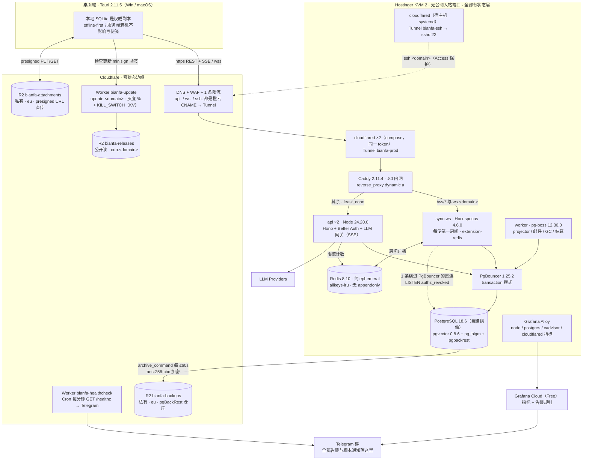

<!--
  文件作用：bianfa 生产环境运维手册（给运维者 = 开发者自己）。事故当天照着敲，不需要再翻方案文档。
            架构一图 → 首次部署 30 天 → 日常发版 → 备份恢复 → 7 条告警 → 7 类故障 → 密钥清单 → 升级决策 → 演练日历 → 平台总管理员。
  来源章节：第 1 章 0.3 S3/S5、0.4 架构图；第 3 章 2.4（签名 / updater / 灰度）+ docs/ADR-001（v1 不买代码签名，macOS 自签名）；
            第 9 章 8.4–8.13；第 10 章 9.3.5（kill switch）、
            9.4.5（容器加固）；第 17 章 #28/#29/#30/#74；§7.7 与 §11 另据第 6 章 5.6（总管理员端点与边界）与第 10 章 9.4.6（设计理由）；
            以及 infra/vps/*、infra/cloudflare/* 里已经写好的脚本与手册。
            与第 9/10 章正文冲突处，以第 1 章跨模块裁定为准（Tunnel 架构、pg-boss、Redis 纯 ephemeral、三把 R2 key）。
  本文每一条命令的参数都对照了脚本源码（deploy.sh / backup.sh / restore.sh / bootstrap.sh / break-glass.sh / notify.sh / platform-admin.sh /
            cron.d/bianfa、两个 Worker 的 wrangler.toml 与 src/index.ts）。脚本没有的参数，本文不写。
  必须人工替换（全文统一写法，不要用会被误当真值的假数据）：
    <REPLACE_ME:domain>            根域，例如 example.com（api. / ws. / ssh. / update. / cdn. 都挂在它下面）
    <REPLACE_ME:account-id>        Cloudflare 账号 ID
    <REPLACE_ME:tunnel-id-prod>    bianfa-prod Tunnel 的 UUID
    <REPLACE_ME:tunnel-token-ssh>  bianfa-ssh Tunnel 的 token（只在 `cloudflared service install` 那一刻用，不落盘）
    <REPLACE_ME:kv-namespace-id>   update-worker 的 ROLLOUT KV namespace id
    <REPLACE_ME:vps-ip>            VPS 公网 IP（只在 break-glass 用）
    <REPLACE_ME:repo-url>          仓库地址（git clone 用）
    <REPLACE_ME:ghcr-org>          ghcr.io/<org>/bianfa-api 的 org 名
    <REPLACE_ME:admin-email>       Access Policy `admin` 精确匹配的运维邮箱
    <REPLACE_ME:migrate-command>   数据库迁移的一次性命令（apps/api 定稿后回填，见 §4.1.3）
    <REPLACE_ME:monthly-budget-usd>  LLM 平台代付的月度预算（美元），告警 6 的阈值基数
    <REPLACE_ME:ops-user-ed25519-public-key>  ops 用户的 SSH 公钥（bootstrap.sh 的 OPS_SSH_PUBKEY）
  本文引用的 infra/docker/*、infra/vps/*、infra/cloudflare/*、.github/workflows/* 均已在仓库中（2026-09-05 整合，见 infra/README.md）。
  仓库里【尚未落地】、命令因此还跑不起来的只剩：apps/api 与 apps/sync 的源码及 Dockerfile（compose 拉 ghcr.io/<org>/bianfa-api / bianfa-sync，
    backend.yml 负责构建）；数据库 schema（infra/vps/restore-checks.sql 的三个表名按第 4 章 DDL 与 C9 写，定稿后核对）。
  主机指纹用 vars.VPS_SSH_HOST_KEY 运行时生成，不提交 .github/known_hosts。
  核实日期：2026-09-05。凡标 [待核实] 的句子不要当事实引用；版本号见文末「核实记录」。
-->

# bianfa 运维手册（RUNBOOK）

> 使用方式：**事故时先看 §0 速查和 §7 故障手册，不要从头读。** 平时按 §10 的演练日历把每个流程跑一遍——没跑过的流程在事故当天等于不存在。

---

## 0. 一页速查

### 0.1 三条不变量（违反任何一条 = 架构被改坏了）

1. **VPS 没有任何公网入站端口。**（**共存模式例外**：`bootstrap.sh --prepare --coexist` 用于已经跑着别的项目的宿主机，这条在那台机器上不成立，见 §2 开头）`sudo ufw status` 里唯一的 allow 规则是 `172.20.0.0/14 → 22/tcp` 与 `10.77.0.0/24 → 22/tcp`（容器网段里的 cloudflared 进 sshd，bootstrap.sh 写的）；compose 里不得出现 `ports:`（break-glass 的 override 例外，用完必须 `--revert`）。
2. **有状态的东西只在 VPS 上。** Cloudflare 侧只有 DNS/WAF、R2 三个桶、两个 Worker、KV 开关。Redis 里没有任何持久数据（`allkeys-lru`、不开 appendonly），挂了直接重启。
3. **两把不可恢复的密钥都不在 VPS 上。** updater minisign 私钥（GitHub Environment `release` + 两处离线介质）、kill-switch 第二私钥（永久离线，从不进 CI）。VPS 上的一切都可以从 git + R2 备份重建。

### 0.2 登录与别名

```sh
# 笔记本 ~/.ssh/config 已按 infra/cloudflare/access-ssh.md §4.1 / tunnel-setup.md §3.4 配好（ProxyCommand cloudflared access ssh）
ssh bianfa-prod                       # = ssh ops@ssh.<REPLACE_ME:domain>，首次弹浏览器过 Access

# 登上去后先贴这一行（所有脚本都用同一组参数，别手敲 compose 路径）
alias dc='sudo docker compose --project-directory /srv/bianfa/app/infra/docker --env-file /srv/bianfa/.env.prod'
```

| 目录 / 文件 | 内容 |
|---|---|
| `/srv/bianfa/app` | 仓库 checkout，属主 ops（`infra/docker/` 里是 compose 与 Caddyfile、pg/ 镜像） |
| `/srv/bianfa/.env.prod` | 全部生产密钥，root:root 0600，由 CI 渲染；**不进 git** |
| `/srv/bianfa/.tag.current` | 当前运行的镜像 tag（deploy.sh 成功后才写） |
| `/srv/bianfa/log/{deploy,backup,restore,break-glass,cron}.log` | 各脚本日志，logrotate 每周 |
| `/srv/bianfa/run/` | `deploy.lock`、break-glass 的 `compose.break-glass.yml` / `Caddyfile.break-glass` / `break-glass.active` |
| `/var/lib/bianfa/{prepared,locked_down}` | bootstrap.sh 的阶段标记 |
| `/srv/bianfa/app/infra/vps/*.sh` | `bootstrap` / `deploy` / `backup` / `restore` / `break-glass` / `notify` / `platform-admin`（§11） |

### 0.3 十条最常用命令

```sh
dc ps                                                   # 全部容器状态（api ×2、cloudflared ×2 应为 healthy）
dc logs --tail 200 -f api                               # 看 api 日志
curl -fsS https://api.<REPLACE_ME:domain>/healthz       # 外部路径（边缘 → Tunnel → Caddy → api）
sudo /srv/bianfa/app/infra/vps/deploy.sh v1.2.3         # 部署 / 回滚都是它：给旧 tag 就是回滚
sudo /srv/bianfa/app/infra/vps/backup.sh info           # 备份清单（pgbackrest info）
sudo /srv/bianfa/app/infra/vps/backup.sh check          # 归档链路是否健康
sudo test -f /srv/bianfa/run/break-glass.active && sudo cat /srv/bianfa/run/break-glass.active   # 是否处于 break-glass 状态（脚本没有 --status）
dc exec -T -u postgres postgres psql -X -c 'select count(*) from pg_stat_activity'
df -h / && sudo docker system df                        # 磁盘
sudo /srv/bianfa/app/infra/vps/notify.sh ok "test"      # Telegram 通道是否活着
```

---

## 1. 架构一图



**谁挂了影响什么、谁来告诉你**（事故判定先查这张表）：

| 组件 | 挂了之后 | 谁告诉你 | 去哪一节 |
|---|---|---|---|
| cloudflared ×2（bianfa-prod） | api/ws 全部不可达；桌面端进离线模式，本地照常可写 | healthcheck Worker `[DOWN]` + `[DEGRADED] cloudflared connectors: 0 healthy` | §7.1 |
| api | 登录 / REST / AI 不可用；同步（ws）仍在 | healthcheck Worker `[DOWN]` | §6.1 |
| sync-ws | 同步停，客户端离线待同步 | 告警 5（WS 连接骤降） | §6.5 |
| postgres | 全站写入失败；api/ws/worker 报错 | 告警 1 + 3；backup.sh check 失败 | §7.2 |
| redis | Hocuspocus 跨副本广播失效、限流失效；**无数据丢失** | 间接：告警 5 | `dc restart redis` |
| Cloudflare 全局 / Zero Trust | 同上第一行，且 Access SSH 也进不去 | cloudflarestatus.com | §7.1（break-glass） |
| VPS 整机 | 全部 | healthcheck Worker `[DOWN]` + Grafana `up == 0` | §5.4（restore.sh） |
| Grafana Cloud / Telegram | 你变成盲飞，服务本身没事 | 每天看一眼 Telegram 是否有 15:00 UTC 的 check 消息（失败才发；平时用 §10 的季度演练确认通道活着） | §6.0 |

---

## 2. 首次部署 30 天顺序（第 9 章 8.13 展开成命令）

> 顺序按**前置期**排，不按兴趣排。D1 原来的两项签名身份申请（各有 1–20 个工作日审核期）按 **ADR-001** 改为**可选**：v1 不买，
> 替代动作是 1 分钟生成一张 macOS 自签名证书。以后要买时再回来做那两行，流水线不用改。

> **共存模式**（2026-09-06 加）：如果 VPS 上已经跑着别的 Docker 项目（例如同一台机器还挂着 WordPress、n8n、Gitea），专机模式的 D3/D4 会伤到它们：
> 改 Docker daemon.json 并重启 dockerd（全部容器闪断、以后新发布端口只绑回环）、改 sshd 禁 root/禁密码、装 ufw 默认拒绝入站。
> 这种机器用 `bootstrap.sh --prepare --coexist`：只建用户、目录、模板、cron 与（可选）宿主机 cloudflared；D4「锁防火墙」**不做**（脚本也会拒绝），
> D5 break-glass 的 ufw 部分自动跳过。代价写在 §0.1 不变量 1。compose 固定子网 `10.77.0.0/24`、`10.77.1.0/24`，脚本会预检不与机上已有网络重叠。
> 专机（推荐）与共存的取舍：出事影响面。共存模式下任何一个同机容器被打穿 = bianfa 的库一起沦陷。

| 天 | 做什么 | 具体动作 | 完成判据 |
|---|---|---|---|
| **D1** | **macOS 自签名证书**（ADR-001，必做，1 分钟） | 本机跑 `infra/ci/make-selfsign-cert.sh`（需 openssl）→ 终端打印三个 secret，填 GitHub Environment `release`：`MACOS_SELFSIGN_P12` / `MACOS_SELFSIGN_P12_PASSWORD` / `MACOS_SELFSIGN_IDENTITY` → `selfsign/key.pem` 与 `selfsign.p12` 存密码管理器 → `rm -rf selfsign/`。**为什么不能省**：Apple Silicon 必须签名，没身份时 Tauri 用 ad-hoc，ad-hoc 身份每次构建都变 → 用户每次自动更新后 Keychain 登录态与通知权限丢失 | 三个 secret 存在；密码管理器有 `.p12` 副本；证书到期日（默认 10 年）进日历。**这把私钥就是 app 身份**：丢了换一张 = 存量用户在那次更新后重新登录一次 |
| **D1（可选，v1 不做）** | 提交 Windows 托管签名身份验证 | Azure 门户 → 创建 **Azure Artifact Signing** 账户（曾用名 Trusted Signing / Code Signing）→ Identity validation（个人 / 组织，**先定主体**）→ 建 Certificate profile（Public Trust）→ App registration 拿 `AZURE_CLIENT_ID / AZURE_CLIENT_SECRET / AZURE_TENANT_ID`。存 GitHub Environment `release`。本地 `cargo install artifact-signing-cli` 验证工具可装 | 身份验证进入 In progress；到期日 + **60 天提前提醒**进日历（到期不续 = 证书停发 = 发版中断） |
| **D1（可选，v1 不做）** | 注册 Apple Developer Program（ADR-001 §5 任一条件成立时再来） | developer.apple.com 注册（1–2 周审核）→ 拿到后建 `Developer ID Application` 证书（有效 5 年）→ App Store Connect → Users and Access → Integrations → **API Key**（不要 app-specific password）→ 记下 Key ID / Issuer ID / `.p8` | `.p12`（base64）+ 密码、`AuthKey.p8` 进 GitHub Environment `release`；证书到期日进日历 |
| **D2** | 决定仓库公开 / 私有 | 公开仓 Actions 免费（macOS runner 10× 计费的唯一解法）。决定后写进 README | 决定已落字 |
| **D3** | VPS 初始化（阶段 A，不锁防火墙） | Hostinger 开 KVM 2（Ubuntu 24.04）。**root 口令先存密码管理器**（浏览器 Terminal 逃生口要用）。`ssh root@<REPLACE_ME:vps-ip>` 后：<br/>`git clone <REPLACE_ME:repo-url> /tmp/bianfa && OPS_SSH_PUBKEY='<REPLACE_ME:ops-user-ed25519-public-key>' bash /tmp/bianfa/infra/vps/bootstrap.sh --prepare`<br/>`su - ops -c 'git clone <REPLACE_ME:repo-url> /srv/bianfa/app'`（`/srv/bianfa` 属主 ops，bootstrap 建好的）<br/>手工填 `/srv/bianfa/.env.prod`（bootstrap 已放模板；至少 `CF_TUNNEL_TOKEN` / `BIANFA_DOMAIN` / `ACME_EMAIL` / `TG_BOT_TOKEN` / `TG_CHAT_ID`） | `/var/lib/bianfa/prepared` 存在；`sudo docker compose version` 正常；`sudo /srv/bianfa/app/infra/vps/notify.sh ok "vps up"` 在 Telegram 收到 |
| **D3** | 建两条 Tunnel | 业务：按 `infra/vps/tunnel-setup.md` §1–2：Zero Trust → Networking → Tunnels → `bianfa-prod`（token 进 `.env.prod` 的 `CF_TUNNEL_TOKEN`）；`dc up -d cloudflared`；Public hostname `api → http://caddy:80`、`ws → http://caddy:80`。<br/>SSH：按 `infra/cloudflare/access-ssh.md` §1：`bianfa-ssh` 宿主机 `sudo cloudflared service install <REPLACE_ME:tunnel-token-ssh>`，Public hostname `ssh → ssh://localhost:22` | 控制台两条 Tunnel 均 Healthy；`bianfa-prod` 有 **2 个 connector**（Overview 里两个 connector ID、同一 Origin IP） |
| **D4** | Access 保护 SSH | `access-ssh.md` §2：Self-hosted 应用 `bianfa-ssh`（域 `ssh.<REPLACE_ME:domain>`），Policy `admin`（Allow，Emails = `<REPLACE_ME:admin-email>` 精确匹配）+ Policy `ci-deploy`（**Service Auth**，Service Token = `bianfa-ci-deploy`）；§5 建 service token → GitHub Environment `prod` 的 `CF_ACCESS_CLIENT_ID` / `CF_ACCESS_CLIENT_SECRET`。笔记本 `cloudflared access ssh-config --hostname ssh.<REPLACE_ME:domain>` 输出写进 `~/.ssh/config`（Host 别名 `bianfa-prod`，User ops） | **从笔记本** `ssh bianfa-prod` 成功（不是 IP 直连）；Zero Trust → Logs → Access 里看到这次登录 |
| **D4** | 锁防火墙 | 上一步成功后：`sudo /srv/bianfa/app/infra/vps/bootstrap.sh --lockdown`（要输入确认短语 `I HAVE TESTED CLOUDFLARED SSH`）。hPanel → VPS → Firewall 再加一条「拒绝全部入站」（出站不要限：7844 udp/tcp、443、R2、Telegram 都是出站） | `nc -vz -w 5 <REPLACE_ME:vps-ip> 22` 从外网超时；`sudo ufw status` 只有 `172.20.0.0/14 → 22/tcp` 一条 allow；`/var/lib/bianfa/locked_down` 存在；**再登录一次**确认没把自己锁外面 |
| **D5** | break-glass 演练（判据要 api 在线，实际排在 D8 之后做） | Cloudflare → SSL/TLS → 模式 **Full (strict)**（提前设好，后面橙云回切要它）。<br/>季度型：`sudo /srv/bianfa/app/infra/vps/break-glass.sh --drill` → `sudo /srv/bianfa/app/infra/vps/break-glass.sh --revert --drill`（不改 DNS、Caddy 自签、~2 分钟）。<br/>完整型：`sudo /srv/bianfa/app/infra/vps/break-glass.sh --staging`（LE staging，不消耗正式限速）→ 按屏幕提示把 `api` 的 CNAME 改成 **A `<REPLACE_ME:vps-ip>`，DNS only（灰云）** → 轮询通过 → `--revert` → DNS 改回 CNAME | 两次都 healthz 200；**从执行到 200 的秒数记在 §10 的演练表里**；`git -C /srv/bianfa/app status` 干净；`sudo ufw status \| grep 443` 为空 |
| **D6–7** | 自建 pg 镜像 + 起基础设施 | `dc build postgres`（基于 `pgvector/pgvector:0.8.6-pg18-trixie` + pg_bigm + PGDG 的 pgbackrest，约 5–10 分钟）。`dc up -d postgres pgbouncer redis caddy`。验证：<br/>`dc exec -T -u postgres postgres psql -X -c "show shared_preload_libraries"` → 含 `pg_stat_statements,pg_bigm`<br/>`dc exec -T -u postgres postgres psql -X -c "show io_method"` → `worker`<br/>`dc exec -T -u postgres postgres psql -X -c "create extension if not exists vector; create extension if not exists pg_bigm; create extension if not exists pg_stat_statements;"`<br/>`dc exec -T redis redis-cli config get maxmemory-policy` → `allkeys-lru`；`dc exec -T redis redis-cli config get appendonly` → `no` | 4 个基础容器 healthy；`dc exec -T postgres pgbackrest version` 打印 **2.59.x**（PGDG apt 当前发布版；2.60.0 尚未发布，见附录 A） |
| **D8** | 起应用栈（空壳镜像也行） | CI 先出一版 `ghcr.io/<REPLACE_ME:ghcr-org>/bianfa-api:v0.0.1` 与 `bianfa-sync:v0.0.1`（只需 `/healthz`）。`sudo /srv/bianfa/app/infra/vps/deploy.sh v0.0.1` | `curl -fsS https://api.<REPLACE_ME:domain>/healthz` → 200；Telegram 收到「deploy 完成」 |
| **D9** | pgBackRest 建仓 + 第一份全量 | 按 `infra/cloudflare/r2.md` §2/§4：`npx wrangler r2 bucket create bianfa-backups --jurisdiction eu`；建 Account API token `bianfa-backups-rw`（Object Read & Write，只限该桶）；生成 32 字节口令 `openssl rand -hex 32` → **先写进密码管理器 + 一份离线介质**，再填 `.env.prod` 的 `PGBACKREST_REPO1_CIPHER_PASS / PGBACKREST_REPO1_S3_KEY / PGBACKREST_REPO1_S3_KEY_SECRET`（backup.sh 从这三个键校验，且要求 postgres 容器 env 里也有——compose 的 postgres 服务需 `env_file: [.env.prod]`）；`dc up -d postgres`（重载 env）。<br/>`dc exec -T -u postgres postgres pgbackrest --stanza=bianfa --log-level-console=info stanza-create`<br/>`sudo /srv/bianfa/app/infra/vps/backup.sh check`<br/>`sudo /srv/bianfa/app/infra/vps/backup.sh full` | `backup.sh info` 显示 1 个 full；`dc exec -T -u postgres postgres psql -X -c "select last_archived_wal from pg_stat_archiver"` 非空。<br/>注：第 9 章 8.7「口令不存 VPS」在 archive_command 由 PG 进程执行的前提下做不到（`.env.prod` 里必须有一份）；能做到的是**权威副本在 VPS 之外**，VPS 丢了不等于备份不可解密 |
| **D10** | **立刻做第一次恢复演练** | 在笔记本（或 GitHub Actions runner）上按 §5.3 的「异机恢复」跑一遍：从 R2 restore 到临时容器 → 启库 → `pg_amcheck --all` | 临时库里能 `select count(*) from "user"`（或任何一张表）；**口令抄错在今天暴露，不是事故当天** |
| **D11** | 监控 agent | 按 §6.0：Alloy 是 compose 里的 `alloy` 服务（不装宿主机），填好 `.env.prod` 的 `GRAFANA_CLOUD_*` 后 `dc up -d alloy`，指向 Grafana Cloud Free（注册即得 stack）。`sudo mkdir -p /var/lib/node_exporter/textfile_collector`（backup.sh 检测到该目录存在才写指标） | Grafana Cloud → Explore 能查到 `node_filesystem_avail_bytes` 与 `cloudflared_tunnel_ha_connections` |
| **D12** | 7 条告警 + Telegram | Grafana Cloud → Alerting → Contact points → Telegram（同一个 bot / 群）；按 §6 建 7 条规则。部署黑盒探测 Worker：`cd infra/cloudflare/healthcheck-worker && npx wrangler kv namespace create STATE`（id 填 wrangler.toml）→ `npx wrangler secret put TELEGRAM_BOT_TOKEN` → `npx wrangler secret put TELEGRAM_CHAT_ID` → 想要告警 7：wrangler.toml `[vars]` 填 `CF_ACCOUNT_ID` / `CF_TUNNEL_ID`，再 `npx wrangler secret put CF_API_TOKEN`（权限「Cloudflare Tunnel: Read」[待核实 权限组精确名]）→ `npx wrangler deploy` | 故意 `dc stop api` 2 分钟 → Telegram 收到 `[DOWN]`；`dc start api` → 收到 `[RECOVERED]` |
| **D13** | R2 发布桶 + 更新 Worker | `r2.md` §2/§3：建 `bianfa-releases`（`--location weur`）、`bianfa-attachments`（`--jurisdiction eu`）、自定义域 `cdn.`、CORS、lifecycle；三把 token 各限一桶。`cd infra/cloudflare/update-worker && npx wrangler kv namespace create ROLLOUT`（id 填 wrangler.toml）→ `npx wrangler kv key put --namespace-id <REPLACE_ME:kv-namespace-id> --remote KILL_SWITCH 0` → `npx wrangler kv key put --namespace-id <REPLACE_ME:kv-namespace-id> --remote ROLLOUT_PERCENT 0` → `npx wrangler deploy` | `curl -i https://update.<REPLACE_ME:domain>/healthz` → `ok`；`curl -i https://update.<REPLACE_ME:domain>/windows/x86_64/0.0.1` → 204 且响应头 `x-bianfa-update: no-manifest` |
| **D14** | CI 部署链路打通 | `.github/workflows/backend.yml`（触发：`push` 到 `main`，镜像 tag = `sha-<40hex>`；**不用 `pull_request_target`**；所有 `uses:` pin 到 commit SHA；Environment `prod`）：build → push ghcr → `ssh bianfa-prod current`（记回滚目标）→ `ssh bianfa-prod deploy sha-…` → 经 Cloudflare 冒烟 `/healthz`，失败回滚上一 tag。**日常部署不重推 `.env.prod`**；首次与密钥变更时人工执行 `ssh bianfa-prod deploy-with-env <tag> < rendered.env.prod`（forced command 下 scp 走不通，也不需要）。CI 身份按 `access-ssh.md` §5：VPS 建 `deploy` 用户（bootstrap.sh 完成），公钥带 forced command → `infra/vps/deploy-entry.sh`（只认 `current` / `deploy <tag>` / `deploy-with-env <tag>`），私钥进 Environment `prod` 的 `VPS_DEPLOY_SSH_KEY`；主机指纹放 repository variable `VPS_SSH_HOST_KEY`（VPS 上 `cat /etc/ssh/ssh_host_ed25519_key.pub`），换机 / restore.sh 后要更新 | 合并一次 main 走完整流水线，Telegram 收到 deploy 消息 |
| **D15–24** | 业务代码 | 上面全是一次性成本，之后不再占时间 | — |
| **D25** | **updater 密钥与 kill-switch 密钥**（发第一版前必做） | `pnpm tauri signer generate -w ~/.tauri/bianfa.key`（会要口令）。私钥 + 口令 → GitHub Environment `release`（required reviewers）`TAURI_SIGNING_PRIVATE_KEY` / `TAURI_SIGNING_PRIVATE_KEY_PASSWORD`；**两处离线介质**（U 盘 / 纸质 QR）+ 密码管理器；`rm ~/.tauri/bianfa.key`。公钥进 `tauri.conf.json > plugins.updater.pubkey`。<br/>再生成 **第二对** Ed25519（kill switch，`/v1/notice` 验签，第 10 章 9.3.5）：私钥只留离线介质 + 密码管理器，**永不进 CI**；公钥编译进客户端 | 第 17 章 #74 的「巴士因子文档」写完：两对密钥 + macOS 自签名证书 +（若已购买）签名身份 / Apple 账号 + 域名 + R2 + DNS 的恢复路径，一个信任的人能取到 |
| **D26** | 发版 CI 全流程计时 | 用 `v0.1.0-rc.1` 跑一次完整 release（构建 + 自签名 + updater 签名 + 上传 R2 + latest.json），**记录总耗时**——这就是 hotfix 前滚的最短时间（第 17 章 #30 要求 ≤ 30 分钟） | 耗时写进 §10 |
| **D27–29** | 灰度发第一版 | §4.2 的顺序，ROLLOUT_PERCENT 5 → 25 → 100 | 至少一台真机走 updater 完成升级 |
| **D30** | 复核 | 走一遍 §0.1 三条不变量、`r2.md` §8、`dns-and-waf.md` §6、`access-ssh.md` §6 的核对清单 | 全部打勾 |

---


### 2.1 应用上线（2026-09-06 更新：代码已齐，替换 D8 的「空壳镜像」）

前置：D6–7 的数据层已 healthy，D9–10 备份与恢复演练已过。全部在 VPS 上以 `root`（或 ops）执行，`dc` 是 §1 的别名。

| 步 | 动作 | 判据 |
|---|---|---|
| 1 | `git -C /srv/bianfa/app pull` 到含本节的提交 | `ls /srv/bianfa/app/infra/vps/{pg-roles,auth-bootstrap}.sh` 存在 |
| 2 | 补 `.env.prod`：`PG_WORKER_PASSWORD`（`openssl rand -hex 32`）、`APP_ORIGIN=https://api.<domain>`（Web 登录/注册/找回密码/设备码/邀请页由 api 同源提供）、`BETTER_AUTH_SECRET` 与 `SYNC_TOKEN_SECRET`（各 `openssl rand -base64 48`）、`R2_ATTACHMENTS_*`（按 `infra/cloudflare/r2.md` 建 `bianfa-attachments` 桶与只限该桶的 token；没有则附件功能返回 503 `attachments_disabled`，其它照常）。**邮件服务完全可选**：`RESEND_API_KEY` + `MAIL_FROM` 缺省时走 console 邮件通道，而账号流程不依赖任何邮件——注册 = 邮箱（只作登录标识，不验证）+ 密码 + 安全码，忘记密码在 Web `/forgot-password` 用安全码重置，团队邀请的响应直接带 `invite_url` 供邀请人手动发送；`MAIL_CONSOLE_LINKS=1` 只在想从日志里看邮件链接时才需要。可选 `GOOGLE_CLIENT_ID/SECRET`、`APPLE_*` | `grep -c REPLACE_ME /srv/bianfa/.env.prod` 只剩 Grafana/Sentry/Stripe/Resend 这些可选项 |
| 3 | `infra/vps/pg-roles.sh`：在已初始化的库上幂等创建/更新 `bianfa_worker`（BYPASSRLS，worker 专用）与 pgboss schema 双向默认权限；也用于以后改密码 | 输出三行角色表，`bianfa_worker` 的 `rolbypassrls = t` |
| 4 | `dc up -d --force-recreate pgbouncer`（userlist 多了 worker 用户） | `dc ps pgbouncer` healthy |
| 5 | 出镜像：合并到 `main` 后 `backend.yml` 自动构建并推 `ghcr.io/<GHCR_NAMESPACE>/bianfa-{api,sync}:sha-<40hex>`（需 GitHub `vars.GHCR_NAMESPACE`；`deploy` job 没配 Access SSH 会失败但不影响镜像）。VPS：`docker login ghcr.io -u <github用户> --password-stdin <<< "$GHCR_READ_PAT"`（read:packages 的 PAT，只在 VPS 输入） | `docker manifest inspect ghcr.io/<ns>/bianfa-api:sha-<hex>` 成功 |
| 6 | `infra/vps/deploy.sh sha-<hex>`：拉镜像 → **`node dist/migrate.js` 以超级用户直连跑 drizzle 迁移（0000–0007）** → 滚动 api/sync-ws/worker → 容器内 `/healthz` → 外部 `/healthz`；失败自动回滚容器（schema 不回滚，迁移只增不删） | Telegram 收到成功通知；`dc ps` 三个应用服务 healthy |
| 7 | `infra/vps/auth-bootstrap.sh`（一次）：创建桌面端 OAuth 公共客户端 `bianfa-desktop`（PKCE、回调 `http://127.0.0.1/cb`） | 日志 `oauth client created`；再跑一次是 `already present` |
| 8 | 验证：`curl -fsS https://api.<domain>/healthz`、`curl -fsS https://api.<domain>/api/auth/ok`、`curl -s https://api.<domain>/login | head -c 300` 是 HTML、`curl -si -H 'Connection: Upgrade' -H 'Upgrade: websocket' -H 'Sec-WebSocket-Version: 13' -H 'Sec-WebSocket-Key: dGVzdA==' https://ws.<domain>/ws/v1 | head -1` 返回 `101`（之后等 Auth 帧） | 四条全过 |
| 9 | 桌面端：`Settings → 账号 → 登录`（浏览器走 `/api/auth/oauth2/authorize` → `/login` → `/consent` → 回环 `127.0.0.1:<port>/cb`）；或「改用验证码登录」到 `https://api.<domain>/device` | 登录后 `/v1/me` 有 `personal_workspace_id`，托盘同步点变实心 |

回滚：`deploy.sh <上一个 sha> --skip-migrate`。迁移失败（步骤 6 exit 3）时容器未动，修好再跑。

## 3. 约定

- **一切变更走 git。** VPS 上不手改 compose / Caddyfile / cron；改了 `git -C /srv/bianfa/app status` 会脏，deploy.sh 之前必须干净。
- **compose 多副本 = 同时重建，接受约 5 秒中断。** 不追求零停机（第 9 章 8.5）。桌面端 offline-first + 指数退避兜底。
- **基础设施容器（postgres / pgbouncer / redis / caddy / cloudflared）不在 deploy.sh 的路径上**（脚本默认 `SERVICES="api sync-ws worker"`）。升级它们是手工维护窗口的事（§4.3）。
- **所有告警与脚本通知落同一个 Telegram 群。** 静音的是 `OK/INFO`，响铃的是 `WARN/FAIL`（notify.sh 的约定）。
- **时间一律 UTC。** cron 03:00 UTC = 北京 11:00；要改成北京凌晨见 `infra/vps/cron.d/bianfa` 注释。
- **容器一律非 root**（`USER 10001:10001`、`read_only` + tmpfs、`cap_drop: [ALL]`、`no-new-privileges`，第 10 章 9.4.5）；postgres 容器例外地以镜像自带的 `postgres` 用户运行，所以本文对它的 exec 都带 `-u postgres`。任何地方出现 `--privileged` 或 `0.0.0.0:` 端口映射（break-glass 期间的 443 除外）都是架构违规。

---

## 4. 日常发版

### 4.1 后端（api / sync-ws / worker）

#### 4.1.1 正常路径（CI）

```sh
git tag v1.2.3 && git push origin v1.2.3
# → .github/workflows/backend.yml（push main 触发，镜像 tag 为 sha-<40hex>；v* 留给 desktop.yml）：
#    1. 构建并推送 ghcr.io/<REPLACE_ME:ghcr-org>/bianfa-api:v1.2.3 与 bianfa-sync:v1.2.3（worker 与 api 同镜像）
#    2. ssh bianfa-prod current                 # 记下线上 tag 作回滚目标（forced command 子命令，不需要 shell）
#    3. ssh bianfa-prod deploy sha-<40hex>      # forced command → sudo /srv/bianfa/app/infra/vps/deploy.sh <tag>；健康检查失败脚本自动回滚
#    （.env.prod 不在此链路里：首次 / 密钥变更时人工 `ssh bianfa-prod deploy-with-env <tag> < rendered.env.prod`，见 §7.6）
```

Web 面（登录 / 注册 / 找回密码 / 邮箱验证 / OAuth 同意 / `/device` / `/invite/<token>` / 账号页）**没有单独的服务或 CDN**：`apps/web` 的产物在镜像构建期复制到 `apps/server/public/web`，由 api 进程在 `APP_ORIGIN`（= `https://api.<domain>`，`.env.prod` 里 `APP_ORIGIN` 的第一项）同源托管；`curl -sI https://api.<domain>/login` 应返回 `text/html` + `Cache-Control: no-store` + `Content-Security-Policy`。发版就是发 api，没有额外步骤。

deploy.sh 自己做的事（不用你管）：拒绝含 `REPLACE_ME` 的 `.env.prod` → `compose config -q` → `pull`（失败则什么都不动）→ `up -d --no-deps --wait --wait-timeout 120 api sync-ws worker` → 容器内 `wget http://localhost:3000/healthz` 二次确认 → 外部 `https://api.<domain>/healthz`（失败只告警不回滚）→ 写 `.tag.current` → `docker image prune -af --filter until=168h`。**健康检查失败自动回滚到上一个 tag**，两次结果都推 Telegram。

#### 4.1.2 手工部署 / 回滚

```sh
ssh bianfa-prod
cat /srv/bianfa/.tag.current                                  # 现在跑的是哪个
sudo /srv/bianfa/app/infra/vps/deploy.sh v1.2.2               # 回滚 = 部署旧 tag（镜像 7 天内未被 prune 则秒回，否则从 ghcr 拉）
sudo /srv/bianfa/app/infra/vps/deploy.sh v1.2.3 --services "api"   # 只重建一个服务
sudo /srv/bianfa/app/infra/vps/deploy.sh v1.2.3 --no-prune         # 不清理镜像（想保留多个可回滚版本时）
tail -n 50 /srv/bianfa/log/deploy.log
```

另一个部署在跑时会拿不到 `/srv/bianfa/run/deploy.lock`，退出码 75——等它结束，不要 `rm` 锁。

#### 4.1.3 数据库迁移纪律

- 迁移文件在 `infra/migrations/`（drizzle）。**每一版的 schema 必须与上一版代码兼容**（expand → 部署 → 下一版再 contract），因为 deploy.sh 会在健康检查失败时**自动回滚代码但不会回滚 schema**。
- 迁移在部署**之前**用一次性容器跑，不在应用启动时跑（两个 api 副本同时启动会抢锁）：
  ```sh
  export TAG=v1.2.3
  dc pull api
  dc run --rm --no-deps -T -e DATABASE_URL="$(sudo grep -E '^DATABASE_URL_DIRECT=' /srv/bianfa/.env.prod | cut -d= -f2-)" api <REPLACE_ME:migrate-command>
  #   ↑ DATABASE_URL_DIRECT 指向 postgres:5432（不经 pgbouncer）；变量名以 apps/api 定稿为准
  sudo /srv/bianfa/app/infra/vps/deploy.sh v1.2.3
  ```
- 迁移前先 `sudo /srv/bianfa/app/infra/vps/backup.sh diff`（差异备份几十秒），迁移出事可 `--target-time` 恢复到迁移前一分钟（§5.4）。
- 走 PgBouncer transaction 模式的应用代码不能有 session 级 `SET`、不能依赖 prepared statements 跨事务（S3）；迁移容器直连 `postgres:5432`，不受此限。

#### 4.1.4 发版后 10 分钟看什么

```sh
dc ps                                                     # 全 healthy
dc logs --since 10m api sync-ws worker 2>&1 | grep -Ei 'error|fatal' | head
dc exec -T -u postgres postgres psql -X -c "select state, count(*) from pg_stat_activity group by 1"
# Grafana：api 5xx 率、p95、PgBouncer client_waiting；Sentry：新 release 的 issue 数
```

### 4.2 桌面端（Windows NSIS + macOS dmg/app.tar.gz，minisign 签名，R2 + Worker 灰度）

#### 4.2.1 发版顺序（来自 `infra/cloudflare/r2.md` §3.3，**顺序不能换**）

```sh
# 0. 版本号：tauri.conf.json / Cargo.toml / package.json 三处一致，tag 形如 v1.4.2
git tag v1.4.2 && git push origin v1.4.2
# → .github/workflows/desktop.yml（environment: release，required reviewers；触发仅 tag push；uses: 全部 pin SHA）：
#    matrix windows-latest（x86_64；aarch64 待第 17 章 #56）/ macos-latest（universal）
#    签名模式（ADR-001：有则签、无则退；workflow 第一步 `判定签名模式` 会在日志里打印）：
#      Windows：只有 AZURE_CLIENT_ID/SECRET/TENANT_ID 三个都在才用 artifact-signing-cli 签 exe（signCommand 必含 %1）；**v1 不签**
#      macOS：APPLE_CERTIFICATE（Developer ID）优先，否则 MACOS_SELFSIGN_P12（自签名）；两者都没有 → 直接失败（禁 ad-hoc）
#             只有 APPLE_API_KEY/ISSUER/KEY_P8 齐了才 notarytool 公证 + stapler；**v1 自签名、不公证**
#    updater：TAURI_SIGNING_PRIVATE_KEY(+_PASSWORD) 生成 .sig，写进 latest.json
#    断言：产物中不得出现字符串 "untrusted comment: minisign"（私钥泄进前端产物的信号，第 10 章 9.3.5）

# 1. 先把灰度关小（KV 不存在时 Worker 视为 100%，所以必须先写）
cd infra/cloudflare/update-worker
npx wrangler kv key put --namespace-id <REPLACE_ME:kv-namespace-id> --remote ROLLOUT_PERCENT 5

# 2. CI 上传二进制到 releases/stable/1.4.2/，逐个确认可下载
for f in bianfa_1.4.2_x64-setup.exe bianfa_1.4.2_universal.dmg bianfa_1.4.2_universal.app.tar.gz; do
  curl -sI "https://cdn.<REPLACE_ME:domain>/releases/stable/1.4.2/$f" | head -n1; done   # 全部 200

# 3. 校验清单（Worker 对坏清单只会静默 204 并记 manifest_invalid 日志，这一步是发现坏清单的主要手段）
jq -e '.version and (.platforms|to_entries|all(.value.url and .value.signature))' latest.json
jq -e '.platforms["darwin-aarch64"] and .platforms["darwin-x86_64"] and .platforms["windows-x86_64"]' latest.json
#    ↑ macOS universal 包必须同时登记两个 darwin key（url/signature 相同），updater 没有 "universal" 兜底

# 4. 最后上传 latest.json（Cache-Control: no-store）
# 5. 观察
npx wrangler tail bianfa-update --format pretty          # decision=serve/not-in-rollout 比例；evt=manifest_invalid 必须为 0
#    Sentry 新版本 crash-free；Telegram 没有新告警
# 6. 放量（每一步之间至少等 1 个工作日或 ≥200 次 serve）
npx wrangler kv key put --namespace-id <REPLACE_ME:kv-namespace-id> --remote ROLLOUT_PERCENT 25
npx wrangler kv key put --namespace-id <REPLACE_ME:kv-namespace-id> --remote ROLLOUT_PERCENT 100
```

自检一台真机：`curl -s -H 'X-Bianfa-Install-Id: test-0001' -H 'X-Bianfa-Channel: stable' -i https://update.<REPLACE_ME:domain>/windows/x86_64/1.4.1 | head -n 12` —— 响应头 `x-bianfa-update: serve|not-in-rollout|up-to-date|no-platform|no-manifest|kill-switch` 与 `x-bianfa-rollout-bucket` 直接告诉你这个 install 落在哪个桶。KV 改动最多 `KV_CACHE_TTL`（60 s）后生效。

#### 4.2.2 出事了怎么办（第 17 章 #30：updater 不做降级）

```sh
# 立即止损：≤60 s 内所有客户端拿到 204（只保护还没升级的用户）
npx wrangler kv key put --namespace-id <REPLACE_ME:kv-namespace-id> --remote KILL_SWITCH 1
```

已升级的用户**只能前滚 hotfix**：修 → `v1.4.3` → 走 4.2.1 全流程（ROLLOUT_PERCENT 先 100，因为受影响的人就是要立刻拿到）→ `KILL_SWITCH 0`。这条链路的耗时就是 D26 记的那个数字，目标 ≤ 30 分钟。

#### 4.2.3 beta 渠道

同一套流程，路径换成 `releases/beta/…`，KV 键 `ROLLOUT_PERCENT:beta`（渠道覆盖全局）。客户端带 `X-Bianfa-Channel: beta`。

### 4.3 基础设施容器升级（手工，维护窗口，半年一次）

```sh
# 改 infra/docker/docker-compose.yml 里的 tag → PR → merge → VPS 上：
sudo -u ops git -C /srv/bianfa/app pull --ff-only
dc pull caddy pgbouncer redis cloudflared
dc up -d caddy                # 秒级中断
dc up -d pgbouncer            # 应用连接会断一次重连
dc up -d redis                # 无数据丢失（纯 ephemeral）
# cloudflared：想不断线就一次只动一个（tunnel-setup.md §4.2 的做法）
one=$(dc ps -q cloudflared | head -n1); sudo docker stop "$one" && sudo docker rm "$one" && dc up -d cloudflared
# postgres 小版本（18.6 → 18.7）：dc build postgres && dc up -d postgres（约 30 s 停写；先 backup.sh diff）
# postgres 大版本（18 → 19）：单独立项，pg_upgrade 或 dump/restore，不在本手册范围
```

Docker Engine 本身不被 unattended-upgrades 自动升级（bootstrap 有意为之）：`sudo apt-get install --only-upgrade docker-ce docker-ce-cli containerd.io` 会重启 dockerd（daemon.json 的 `live-restore: true` 保证容器不死），挑维护窗口做。

---

## 5. 备份与恢复演练

### 5.1 现在是什么状态

| 项 | 目标 | 实现 | 怎么看 |
|---|---|---|---|
| RPO | ≤ 60 s | `archive_timeout=60s` + `archive_command` 连续推 WAL 到 R2 | `dc exec -T -u postgres postgres psql -X -c "select last_archived_wal, last_archived_time, last_failed_time from pg_stat_archiver"` |
| RTO | ≤ 40 min | `restore.sh` 脚本化 | §10 演练表里的实测值 |
| 全量 | 每周日 03:00 UTC | cron → `backup.sh full` | `backup.sh info` |
| 增量 | 周一至周六 03:00 UTC | cron → `backup.sh incr` | 同上 |
| 归档链路校验 | 每日 15:00 UTC | cron → `backup.sh check`，失败推 Telegram | Telegram |
| 保留 | 4 个全量 ≈ 4 周 | `repo1-retention-full=4` | `backup.sh info` |
| 加密 | aes-256-cbc，口令**权威副本在密码管理器 + 离线介质**，VPS 上只有 `.env.prod` 里一份 | pgBackRest repo 级加密 | — |
| 第二层 | Hostinger 每周整机快照 | hPanel → VPS → Backups | 只兜「手滑 rm -rf」，不是 PITR |
| 第三层（Phase 2） | `bianfa-backups-vault` 不可变副本桶 + 每日 rclone | `r2.md` §4.3 | 单双月交替从 vault 演练 |

```sh
sudo /srv/bianfa/app/infra/vps/backup.sh info        # 备份集列表 + WAL 范围
sudo /srv/bianfa/app/infra/vps/backup.sh check       # 归档 + 仓库配置校验（配错在 restore 前唯一能暴露的地方）
sudo /srv/bianfa/app/infra/vps/backup.sh diff        # 手工差异备份（迁移 / 大操作前）
tail -n 40 /srv/bianfa/log/backup.log
```

### 5.2 每月 1 号：GitHub Actions 恢复演练（不在 prod 机上）

工作流 `.github/workflows/restore-drill.yml`（`schedule: '0 4 1 * *'`，environment `backup`）在 runner 的临时 Docker 里做，步骤等价于 §5.3；secrets 用**只读** token `bianfa-backups-ro`（Object Read only，仅 `bianfa-backups`；VPS 上没有；`r2.md` §6 矩阵需补这一行）+ 密码管理器里的口令副本 `PGBACKREST_REPO1_CIPHER_PASS`。结果推 Telegram：备份集、恢复用时、`pg_amcheck` 结果、三条业务 SQL（用户数 / 便笺数 / 最近 24h 写入量）。**演练失败当天必须处理**——它意味着此刻的备份不可恢复。

### 5.3 异机恢复到临时容器（笔记本 / runner，用于演练与取数据）

```sh
# 前提：本机有 docker；镜像用与 prod 相同的 Dockerfile（infra/docker/pg）
docker build -t bianfa-pg ./infra/docker/pg
mkdir -p /tmp/drill/pgdata && chmod 700 /tmp/drill/pgdata
cat > /tmp/drill/pgbackrest.conf <<'EOF'
[global]
repo1-type=s3
repo1-s3-endpoint=<REPLACE_ME:account-id>.eu.r2.cloudflarestorage.com
repo1-s3-bucket=bianfa-backups
repo1-s3-region=auto
repo1-s3-uri-style=path
repo1-cipher-type=aes-256-cbc
[bianfa]
pg1-path=/var/lib/postgresql/18/docker
EOF
# 凭据走环境变量（不落文件）：PGBACKREST_REPO1_S3_KEY / PGBACKREST_REPO1_S3_KEY_SECRET（只读 token）/ PGBACKREST_REPO1_CIPHER_PASS（密码管理器）
export PGBACKREST_REPO1_S3_KEY PGBACKREST_REPO1_S3_KEY_SECRET PGBACKREST_REPO1_CIPHER_PASS
ENVS=(-e PGBACKREST_REPO1_S3_KEY -e PGBACKREST_REPO1_S3_KEY_SECRET -e PGBACKREST_REPO1_CIPHER_PASS)
docker run --rm -u postgres "${ENVS[@]}" \
  -v /tmp/drill/pgbackrest.conf:/etc/pgbackrest/pgbackrest.conf:ro -v /tmp/drill/pgdata:/var/lib/postgresql/18/docker \
  bianfa-pg pgbackrest --stanza=bianfa --log-level-console=info restore            # 最新；或加 --type=time --target='2026-09-05 02:00:00+00' --target-action=promote
docker run -d --name drill -u postgres "${ENVS[@]}" \
  -v /tmp/drill/pgbackrest.conf:/etc/pgbackrest/pgbackrest.conf:ro -v /tmp/drill/pgdata:/var/lib/postgresql/18/docker bianfa-pg \
  postgres -c archive_mode=off -c restore_command='pgbackrest --stanza=bianfa archive-get %f "%p"' \
    -c max_connections=120 -c max_worker_processes=8 -c shared_preload_libraries=pg_stat_statements,pg_bigm
#   ↑ restore_command 要读同一份 conf 与 PGBACKREST_* 环境变量；后三项必须 ≥ prod 的 pg/postgresql.conf（它挂在容器外、不在备份里），
#     否则回放第一段 WAL 就 FATAL "recovery aborted because of insufficient parameter settings"（首台机器演练实测：默认 100 < prod 120）
until docker exec drill pg_isready -q; do sleep 2; done
until [ "$(docker exec drill psql -X -tA -c 'select pg_is_in_recovery()')" = f ]; do sleep 5; done   # 回放完成
docker exec drill pg_amcheck --all --install-missing   # amcheck 扩展默认没装进各库，不加 --install-missing 会 "no relations to check"（演练实测）
docker exec drill psql -X -c 'select count(*) as users from "user"' -c 'select count(*) as notes from notes' \
                      -c "select count(*) as writes_24h from note_updates where created_at > now() - interval '24 hours'"
docker rm -f drill && rm -rf /tmp/drill
```

> PGDATA 路径 `/var/lib/postgresql/18/docker` 来自 postgres:18 官方镜像的默认值（restore.sh 里从镜像 env 动态读取，不硬编码）；prod 的 `pg/pgbackrest.conf` 的 `pg1-path` 与 compose 卷挂载必须与它一致，否则 restore 报错。

### 5.4 真的灾难：VPS 没了 / 数据要回到某个时间点

```sh
# 场景 A：整机不可用 → 新机
# 1. Hostinger 开新 KVM 2（15 min）；root 口令进密码管理器
# 2. 旧机若可能还活着：Zero Trust → Tunnels → bianfa-prod → Overview → Refresh token，新 token 写进 .env.prod（否则新旧两机同时接流量，写入分叉）
# 3. 新机（root）：
git clone <REPLACE_ME:repo-url> /tmp/bianfa && OPS_SSH_PUBKEY='<REPLACE_ME:ops-user-ed25519-public-key>' bash /tmp/bianfa/infra/vps/bootstrap.sh --prepare   # 先不要 --lockdown
/tmp/bianfa/infra/vps/restore.sh --repo <REPLACE_ME:repo-url> --tag v1.2.3 --env-from /root/rendered.env.prod
#   --tag = 旧机的 .tag.current 或 Telegram 最后一条 deploy 成功消息；不给会交互式询问
#   --env-from = CI 渲染或密码管理器副本；restore.sh 会 install -m600 到 /srv/bianfa/.env.prod
# 脚本 8 步：拉代码 → env → TAG → 拉镜像+构建 pg → pgbackrest restore → 启库等回放 → amcheck + 业务 SQL → 起全部服务（--wait 300s）→ 打印收尾清单
# 4. 收尾清单由脚本打印：Tunnel connector 只剩新机、客户端实测、Access SSH 通过后 bootstrap.sh --lockdown、更新 GitHub variable VPS_SSH_HOST_KEY、Alloy 装回、Hostinger 快照、新 timeline 第一份 full

# 场景 B：机器没事，数据被误删 / 坏迁移 → 时间点恢复（会覆盖当前库！先想清楚）
sudo /srv/bianfa/app/infra/vps/backup.sh diff                                 # 先把"现在"也备一份
dc stop api sync-ws worker                                                    # 停写
sudo /srv/bianfa/app/infra/vps/restore.sh --target-time '2026-09-05 02:00:00+00'   # 数据目录非空时脚本会问是否 --delta 覆盖；用 --set <label> 可指定更早的备份集
# 恢复后立刻 sudo /srv/bianfa/app/infra/vps/backup.sh full（新 timeline 上的第一份全量，务必做）
```

### 5.5 口令与 key 轮换（pgBackRest 不能原地换口令）

```
新建 repo2（新口令、新 R2 token）→ postgres 容器加 PGBACKREST_REPO2_* → stanza-create → backup --repo=2 --type=full
→ archive_command 同时推两仓（pgbackrest 默认推所有 repo）→ 等 4 周 retention 过去 → 撤 repo1 配置 → 吊销旧 token
```

---

## 6. 告警响应（7 条）

### 6.0 前置：Alloy 与告警去向

```sh
# Alloy 不装在宿主机 —— 它是 compose 里的 `alloy` 服务（grafana/alloy:v1.19.2，2026-09-05 Docker Hub 核实），随栈一起起停
dc ps alloy                       # 应为 running；镜像（ubuntu:noble 精简版）无 curl/wget 故无 healthcheck，Alloy 自身 up 指标在 Grafana Cloud 侧告警
dc logs --tail 50 alloy           # remote_write 报 401 = GRAFANA_CLOUD_API_KEY 错；429 = 免费额度打满
# 配置在仓库 infra/docker/alloy/config.alloy（+ pg-queries.yaml），只读挂载进容器；改完：
dc up -d --force-recreate alloy
# 凭据全部来自 /srv/bianfa/.env.prod：GRAFANA_CLOUD_PROM_URL / GRAFANA_CLOUD_PROM_USER / GRAFANA_CLOUD_LOKI_URL / GRAFANA_CLOUD_LOKI_USER /
#   GRAFANA_CLOUD_API_KEY；postgres_exporter 用只读监控角色 PG_EXPORTER_USER / PG_EXPORTER_PASSWORD 直连 postgres:5432（不经 pgbouncer）
```

`config.alloy` **已用 alloy v1.19.2 真二进制 `validate`（exit 0）+ `fmt`（无 diff）通过**，采四类目标：`prometheus.exporter.unix`（经 `/:/rootfs:ro` 读宿主机；textfile 目录 `/var/lib/node_exporter/textfile_collector` 也经 rootfs 读，backup.sh 往这里写 `bianfa_backup_*`）、`prometheus.exporter.postgres`（`PG_EXPORTER_DSN`，自定义查询 `pg-queries.yaml` 含 `pg_stat_archiver` 年龄 → 告警 4）、`prometheus.exporter.cadvisor`（docker.sock + /var/lib/docker + /sys，`pid: host` + `DAC_READ_SEARCH/SYS_PTRACE`；**在 read_only + cap_drop ALL 下能否完整读 cgroup v2 [待核实，需真机；不行则去掉 cadvisor 组件或加 SYS_ADMIN]**）、`discovery.docker` + `prometheus.scrape` 抓两个 cloudflared 副本的 `:2000/metrics`（告警 7：`cloudflared_tunnel_ha_connections`）；Alloy 同时在 `edge` 与 `data` 两个网络上，**不需要**给任何服务加宿主机端口映射；`prometheus.remote_write` / `loki.write` 到 Grafana Cloud，断网期间 WAL 缓冲在 `alloy_data` volume。

告警去向：Grafana Cloud → Alerting → Contact points → 新建 **Telegram**（bot token / chat id 与 `notify.sh`、healthcheck-worker 同一个）→ Notification policies 默认路由指向它。下面每条给出规则表达式与「看到它先做什么」。

### 6.1 `/healthz` 连续失败（来源：healthcheck Worker，`FAIL_THRESHOLD=2` 次即报 `[DOWN]`）

**先做**（2 分钟内分清是「边缘/Tunnel」还是「api 自己」）：
```sh
curl -sS -o /dev/null -w '%{http_code}\n' --max-time 10 https://api.<REPLACE_ME:domain>/healthz   # 复现
ssh bianfa-prod                                                                                   # 能进 = bianfa-ssh Tunnel 活着 = Cloudflare 大体正常
dc ps                                                                                             # cloudflared ×2 healthy？api ×2 healthy？
dc exec -T api wget -qO- --timeout=5 http://localhost:3000/healthz                                # 容器内通 + 外部不通 → Tunnel/边缘 → §7.1
dc logs --tail 100 api                                                                            # 容器内也不通 → 看日志：数据库连不上？→ §7.2；OOM？→ dc restart api
```
**不要**先 break-glass：先确认控制台 Tunnel 状态是 Down 且 cloudflarestatus.com 有事故。

### 6.2 磁盘 > 80%（规则：`(1 - node_filesystem_avail_bytes{mountpoint="/"} / node_filesystem_size_bytes{mountpoint="/"}) > 0.8` for 10m）

**先做**：
```sh
df -h / && sudo docker system df -v | head -n 40                     # 镜像/卷/构建缓存各占多少
sudo du -xsh /var/lib/docker/volumes/*/_data 2>/dev/null | sort -h | tail   # pgdata / caddy_data / spool
sudo docker image prune -af --filter "until=168h" && sudo docker builder prune -f --filter "until=168h"
sudo journalctl --vacuum-size=300M
dc exec -T -u postgres postgres psql -X -c "select pg_size_pretty(sum(size)) from pg_ls_waldir()"   # WAL 堆积 = 归档在失败 → 6.4
ls -la /var/lib/docker/volumes/*pgbackrest_spool*/_data 2>/dev/null                                  # spool 堆积 = 推 R2 失败
```
> 90% 还降不下来：`dc stop worker`（GC / projector 先停，减少写入）；再往上就是 §7.3。

### 6.3 PgBouncer 等待连接 > 0 持续 1 分钟（规则：`max_over_time(pgbouncer_pools_client_waiting_connections[1m]) > 0` for 1m）

**先做**：
```sh
dc exec -T pgbouncer psql postgres://postgres@127.0.0.1/pgbouncer -c 'SHOW POOLS;' -c 'SHOW STATS;'   # edoburu 镜像的管理控制台（容器内 127.0.0.1，端口默认 5432）；连接用户必须在 ADMIN_USERS 里且有密码 [待核实 compose 里 ADMIN_USERS 的取值]
dc exec -T -u postgres postgres psql -X -c "select pid, now()-query_start as age, state, wait_event_type, left(query,80) from pg_stat_activity where state<>'idle' order by 2 desc limit 15"
dc exec -T -u postgres postgres psql -X -c "select pid, now()-xact_start from pg_stat_activity where xact_start < now()-interval '5 min'"   # 长事务 → 找到来源再 select pg_terminate_backend(pid)
dc exec -T -u postgres postgres psql -X -c "select calls, mean_exec_time, left(query,100) from pg_stat_statements order by mean_exec_time desc limit 10"
```
持续出现且没有慢查询 → 池太小：`DEFAULT_POOL_SIZE` 25 → 40（PG `max_connections=120` 留余量），改 compose 走 PR。这也是 §9 升级指标之一。

### 6.4 pgBackRest 24 小时无成功归档（规则：`time() - max(bianfa_backup_last_run_timestamp_seconds{mode=~"incr|full"}) > 26*3600` **或** `min(bianfa_backup_last_run_success) == 0` for 5m；backup.sh 的 check 失败也会直接推 Telegram `notify_fail`）

**先做**（RPO 正在恶化，这是数据安全告警）：
```sh
tail -n 60 /srv/bianfa/log/backup.log
dc exec -T -u postgres postgres psql -X -c "select last_archived_time, last_failed_time, last_failed_wal, failed_count from pg_stat_archiver"
dc logs --since 2h postgres 2>&1 | grep -i 'archive-push\|pgbackrest' | tail -n 20
sudo /srv/bianfa/app/infra/vps/backup.sh check           # 常见原因：R2 token 被吊销 / 口令改了 / 桶上误开了 bucket lock（r2.md §4.2）/ 出网被 hPanel 防火墙挡
```
修好后 `sudo /srv/bianfa/app/infra/vps/backup.sh incr`，确认 `pg_stat_archiver.last_archived_time` 更新。若 `pg_ls_waldir()` 已堆了几十 GB，归档恢复后会自动排空，不要手删 WAL。

### 6.5 WebSocket 活跃连接骤降 > 50%（规则：`bianfa_ws_connections < 0.5 * avg_over_time(bianfa_ws_connections[1h] offset 1h)` for 5m；指标由 sync-ws 暴露，名字以 apps/sync 定稿为准）

**先做**：
```sh
dc ps sync-ws && dc logs --tail 200 sync-ws                 # 重启循环？"authz_revoked" LISTEN 直连断了？
dc exec -T -u postgres postgres psql -X -c "select count(*) from pg_stat_activity where query ilike 'listen%'"   # Hocuspocus 的 LISTEN 直连应有 1 条
dc exec -T redis redis-cli ping && dc exec -T redis redis-cli info clients | head   # extension-redis 依赖它
dc restart sync-ws                                          # 客户端自动重连（指数退避），几十秒内连接数回升
```
连接数**没降但用户报同步不动**：看 6.4（WAL 堆积会让写入变慢）和 projector（`dc logs worker`）。

### 6.6 LLM 平台代付月度花费达预算 80%（规则：`bianfa_llm_platform_cost_usd_month > 0.8 * <REPLACE_ME:monthly-budget-usd>`；等价 SQL 见下，可由 worker 每小时计算并暴露）

**先做**（钱在流，先关阀再排查）：
```sh
dc exec -T -u postgres postgres psql -X -d bianfa -f - <<'SQL'
-- 本月平台代付花费（cost_nano_usd 是纳美元整数）
select sum(cost_nano_usd)/1e9 as usd from ai_usage where key_source='platform' and created_at >= date_trunc('month', now());
-- 谁在烧：按用户前 10
select user_id, count(*), sum(cost_nano_usd)/1e9 as usd from ai_usage where key_source='platform' and created_at >= date_trunc('month', now()) group by 1 order by 3 desc limit 10;
-- 是否有 refused/error 循环重试
select status, error_code, count(*) from ai_usage where created_at > now()-interval '1 hour' group by 1,2 order by 3 desc;
SQL
```
处置梯度：① 单账号异常 → 该用户 `ai_opt_in=false` / 该 org `ai_enabled=false`（第 1 章 S2 第 4 步的三级开关会当场 403）+ 审计日志记原因；② 全局异常 → 去 provider 控制台把平台 key 的**月度硬上限**调到当前花费（Anthropic / Google / OpenAI 都有 spend limit），这是唯一不依赖我们代码的止血阀；③ 代码层熔断（全平台月度 $500，第 1 章 C11）如果没触发，是 bug，进 Sentry 排查。BYOK 用户不受任何影响。

### 6.7 cloudflared 健康 connector < 2（来源：healthcheck Worker `[DEGRADED] cloudflared connectors`（需 D12 填了 `CF_ACCOUNT_ID` / `CF_TUNNEL_ID` / `CF_API_TOKEN`）+ Grafana `sum(cloudflared_tunnel_ha_connections) < 8` for 5m）

**先做**（服务还在，只是没冗余了）：
```sh
dc ps cloudflared                                  # 应有 2 个 running (healthy)
dc logs --tail 50 cloudflared                      # 常见：OOM（limit 128M）、token 被 Refresh 过、出网 7844 被挡
dc up -d cloudflared                               # compose 补齐缺的那个副本
for c in $(dc ps -q cloudflared); do ip=$(sudo docker inspect -f '{{range .NetworkSettings.Networks}}{{.IPAddress}}{{end}}' "$c"); curl -s "http://$ip:2000/ready"; echo; done   # readyConnections 各 4
```
两个都起不来且日志里是认证错误 → token 失效：Zero Trust → Tunnels → bianfa-prod → Overview → Add a replica 取 token（或 Refresh token）→ 写 `.env.prod` → `dc up -d cloudflared`。**全部 connector = 0 就是 §7.1。**

---

## 7. 故障手册

每条按 **症状 → 判定 → 处置 → 验证 → 事后** 写。事故中不读理由只敲命令。

### 7.1 Tunnel 挂了（api/ws 全部不可达，VPS 本身没事）

- **症状**：healthcheck Worker `[DOWN]` + `[DEGRADED] cloudflared connectors: 0 healthy`；`ssh bianfa-prod` 可能也不通（若是 Cloudflare Zero Trust 整体故障）。
- **判定**：
  ```sh
  ssh bianfa-prod                       # 通 → 只是 bianfa-prod Tunnel 的问题；不通 → Hostinger hPanel → VPS → Manage → Overview → Terminal（浏览器 noVNC，不经网络 SSH，用 root 口令）
  dc ps cloudflared; dc logs --tail 50 cloudflared      # 容器活着但 Cloudflare 侧 Down → 边缘事故（看 cloudflarestatus.com）；容器死了 → dc up -d cloudflared 即可
  ```
- **处置**（容器重启无效、控制台 Tunnel = Down、cloudflarestatus 有事故时才做；脚本当前只有 ACME 模式）：
  ```sh
  sudo /srv/bianfa/app/infra/vps/break-glass.sh          # 输入 BREAK GLASS 确认；--yes 跳过
  # 脚本：ufw allow in 443/tcp → compose override 给 caddy 加 0.0.0.0:443:443 → 主 Caddyfile 的 ":80 {" 变换为 "https://api.<domain> {"
  #       → caddy validate → 重建 caddy → 轮询 https://api.<domain>/healthz（--resolve 本机 IP，最多 POLL_MINUTES=10 分钟）
  # 你（脚本不代劳 DNS）：dash.cloudflare.com → <domain> → DNS → api：CNAME → 改成 A <REPLACE_ME:vps-ip>，Proxy status = DNS only（灰云）
  #     灰云是为了让 Let's Encrypt 直连本机 443 做 TLS-ALPN-01；脚本轮询通过后再改回 Proxied（橙云）恢复 WAF/DDoS，前提 SSL/TLS 已是 Full (strict)
  ```
  ws 主机名脚本不切；客户端退路是 `wss://api.<domain>/ws/…`（Caddyfile 保留了 `/ws/*` handle）。Origin CA 模式（提前签好 15 年证书、DNS 直接橙云、不依赖 LE）是脚本文末列出的**可选加固，尚未实现**；`dns-and-waf.md` §5 写的 `--mode origin-ca` 目前**不存在**，不要敲。
- **验证**：`curl -fsS https://api.<REPLACE_ME:domain>/healthz`（走公网 A 记录）→ 200；Telegram 收到「break-glass 生效」。
- **恢复**：Tunnel 状态回 Healthy 后
  ```sh
  sudo /srv/bianfa/app/infra/vps/break-glass.sh --revert
  # DNS：api 删 A 记录 → 恢复 CNAME <REPLACE_ME:tunnel-id-prod>.cfargotunnel.com（最省事：Zero Trust → Tunnels → bianfa-prod → Public Hostname 删掉再加一次 api 这条）
  dig +short api.<REPLACE_ME:domain> @1.1.1.1      # 回到 Cloudflare 边缘 IP
  sudo ufw status | grep 443                        # 无
  sudo test -f /srv/bianfa/run/break-glass.active && echo 'still active!'   # 应无输出
  ```
- **事后**：记录「决定 break-glass 的时间 → healthz 200」的分钟数到 §10；公网 IP 暴露过一次，考虑向 Hostinger 申请换 IP（可选）；把 Origin CA 模式排进 break-glass.sh 的 backlog。

### 7.2 PostgreSQL 挂了 / 起不来

- **症状**：api 日志 `ECONNREFUSED` / `the database system is starting up`；告警 1、3；backup.sh 失败。
- **判定**：
  ```sh
  dc ps postgres && dc logs --tail 200 postgres
  # 三种常见：① OOM（KVM 2 上 shared_buffers 必须是 2GB 档，见 §9）② 磁盘满 → §7.3 ③ 配置错（shared_preload_libraries 里的库不存在 → 直接启动失败）
  free -m; df -h /; sudo dmesg -T | grep -i 'killed process' | tail
  ```
- **处置**：
  ```sh
  dc up -d postgres                                   # 大多数情况 crash 后自动 recovery，等 pg_isready
  until dc exec -T -u postgres postgres pg_isready -q; do sleep 3; done
  dc restart pgbouncer sync-ws                        # pgbouncer 的 server 连接、sync-ws 的 LISTEN 直连都要重建；api/worker 走 pgbouncer 会自愈
  ```
  起不来且日志指向数据损坏（`invalid page`、`could not read block`）：**不要**试 `pg_resetwal`。走 §5.4 场景 B，`--target-time` 恢复到崩溃前。
- **验证**：`curl -fsS https://api.<REPLACE_ME:domain>/healthz`；`dc exec -T -u postgres postgres psql -X -c "select count(*) from pg_stat_activity"`；`sudo /srv/bianfa/app/infra/vps/backup.sh check`（归档链路在崩溃后是否继续）。
- **事后**：`dc exec -T -u postgres postgres pg_amcheck --all --install-missing --jobs=2`；若是 OOM，看 §9 是否到升级阈值；确认 Hocuspocus 的 `authz_revoked` LISTEN 已重连（`select * from pg_stat_activity where query ilike 'listen%'`）。

### 7.3 磁盘满（PG 写入报 `No space left on device`）

- **症状**：告警 2 没理会之后的下一步；PG 日志 `PANIC: could not write to file`；容器纷纷重启。
- **判定**：`df -h /`、`sudo docker system df`、`sudo du -xsh /var/lib/docker/volumes/*/_data | sort -h | tail`、`dc exec -T -u postgres postgres psql -X -c "select pg_size_pretty(sum(size)) from pg_ls_waldir()"`。
- **处置**（按可逆性排序）：
  ```sh
  sudo docker image prune -af && sudo docker builder prune -af          # 最先，无副作用（下次部署重新拉）
  sudo journalctl --vacuum-size=200M && sudo apt-get clean
  sudo truncate -s 0 /srv/bianfa/log/cron.log                            # 日志可牺牲
  # WAL 堆积（归档失败导致）→ 先修归档（§6.4），归档成功后 PG 自己清；紧急时只能：
  #   dc stop api sync-ws worker（停写）→ 修 R2/口令 → backup.sh check → 观察 pg_ls_waldir 下降
  # pgbackrest spool 堆积 → 同上，spool 在归档恢复后自动排空
  # 都不够 → Hostinger 升档（§9，磁盘 100 GB → 200 GB，约 10 分钟，数据保留）
  ```
  **永远不要**手删 `pg_wal/` 或 `pgdata/` 里的任何文件。
- **验证**：`df -h /` < 70%；`dc up -d`；`sudo /srv/bianfa/app/infra/vps/backup.sh check`。
- **事后**：为什么告警 2 没被处理（告警到 Telegram 了吗？）；若是附件落了 VPS 盘 → 架构违规（附件必须直传 R2，第 1 章 S1），立即修代码。

### 7.4 证书过期

这套架构里**没有需要人工续期的线上 TLS 证书**（Cloudflare Universal SSL 自动；Tunnel 内部加密自管；Caddy 只在 break-glass 期间用 ACME 自动续）。会过期的是「身份类」凭据，症状全在发布链路而非线上服务：

| 过期的东西 | 症状 | 处置 |
|---|---|---|
| **macOS 自签名证书**（`make-selfsign-cert.sh` 默认 3650 天） | release 工作流 macOS 签名步骤失败（codesign 拒用过期证书）；已发出的版本继续可用 | 重跑 `make-selfsign-cert.sh` → 换三个 `MACOS_SELFSIGN_*` secret。**身份会变**：那一次更新后用户重新登录一次、通知权限重问一次；发版说明里提前写 |
| （仅在启用 Windows 签名时）Azure Artifact Signing **身份验证**（可提前 60 天续，审核 1–20 个工作日） | release 工作流 Windows 签名步骤失败，证书停发（证书本身每日轮换、72 小时有效，自动） | 立即在 Azure 门户 → Artifact Signing → Identity validation → Renew；期间 Windows 不能发新版，macOS 不受影响。**日历提醒 60 天前** |
| （仅在启用 Developer ID 时）Apple Developer Program 会员（年费） | 公证失败；已发出的版本继续可用 | 续费；API Key 不变 |
| （仅在启用 Developer ID 时）Apple `Developer ID Application` 证书（5 年） | 签名失败；已签发的 app 继续有效 | Certificates → 新建 → 导出 `.p12` → 更新 GitHub secret |
| Apple Sign-in 的 client secret JWT（最长 6 个月，第 6 章） | **用户 Apple 登录失败**（这是唯一影响线上的一条） | 轮换 pg-boss 任务应自动生成；失败时手工用 `.p8` 签新 JWT 写入 Better Auth 配置并 `deploy.sh` 当前 tag |
| Cloudflare Access service token `bianfa-ci-deploy`（1 年） | CI 部署 `bad handshake` | Zero Trust → Service tokens → Refresh（延 1 年）；泄露则 Rotate secret |
| break-glass ACME 模式的 Let's Encrypt（90 天） | 只在长期处于 break-glass 时才相关；Caddy 自动续（灰云期间才能续） | 尽快 `--revert` 回 Tunnel |
| （Phase 2）Cloudflare Origin CA（15 年） | break-glass origin-ca 模式实现后才相关 | 重签，放 `/srv/bianfa/secrets/` |

```sh
# 快速核对到期日（本地）
openssl pkcs12 -in selfsign.p12 -nokeys -passin pass:"$P12_PASSWORD" | openssl x509 -noout -enddate   # Developer ID 的 .p12 同理
```

### 7.5 updater 私钥泄露 → kill switch（第 10 章 9.3.5 泄漏预案，上线前必须演练一次）

- **判定**：GitHub `release` Environment 的审计日志出现非预期访问；或离线介质丢失；或任何"可能"——**按泄露处理，不赌**。
- **威胁**：持有私钥者能签出客户端会信任的 `latest.json`；要真正投放还需写 R2 `bianfa-releases` 或劫持 `update.<domain>`，所以同时检查 `bianfa-releases-ci` token 与 Cloudflare 账号。
- **处置（顺序不能换）**：
  ```sh
  # ① 60 秒内让所有客户端拿不到任何更新
  cd infra/cloudflare/update-worker && npx wrangler kv key put --namespace-id <REPLACE_ME:kv-namespace-id> --remote KILL_SWITCH 1
  # ② 吊销发布通道凭据：Cloudflare → R2 → Manage API tokens → 吊销 bianfa-releases-ci；GitHub → Environment release → 删除 TAURI_SIGNING_PRIVATE_KEY(+_PASSWORD)
  # ③ 检查 R2 里有没有被替换的对象（凭据用临时新建的只读 token，走环境变量，不落文件）
  aws s3 ls s3://bianfa-releases/releases/stable/ --recursive --endpoint-url https://<REPLACE_ME:account-id>.r2.cloudflarestorage.com | sort -k1,2 | tail -n 20
  #    对比 CI 日志里的 sha256；可疑对象先 aws s3 rm 掉（版本目录不可变，正常情况下发版后不会再有写入）
  # ④ 通过 kill switch 通道推公告（用离线的第二私钥签名，这把私钥从不进 CI）
  #    /v1/notice 的内容：{"kind":"force-manual-update","min_version":"<受影响版本>","url":"https://cdn.<domain>/…","message":"…"}
  #    minisign -S -s ~/offline/notice.key -m notice.json      （在离线机器上签；把 notice.json 与 .minisig 交给 api 部署或放 R2 由 api 转发）
  #    客户端启动拉 GET /v1/notice → 第二公钥验签 → 阻断运行 + 显示"请手动下载新版本"
  # ⑤ 生成新的 updater 密钥对（D25 流程），公钥编进新版本；新版本用新私钥签
  pnpm tauri signer generate -w ~/.tauri/bianfa-2026-09.key
  # ⑥ 发新版本到 R2（走 4.2.1，但 KILL_SWITCH 保持 1 —— 老客户端用旧公钥无法验证新签名，本来也升不了）
  # ⑦ 官网 / 邮件 / 应用内 notice 三渠道通知手动下载；新客户端装好后 KILL_SWITCH 对它们无意义（它们信任的是新公钥）
  ```
- **验证**：`curl -si https://update.<REPLACE_ME:domain>/windows/x86_64/1.0.0 | grep x-bianfa-update` → `kill-switch`；一台装了旧版的测试机启动后看到 notice 公告。
- **事后**：所有旧版本用户需手动重装一次——**这就是为什么私钥备份纪律排在第一周**。复盘泄露路径；更新第 17 章 #74 的巴士因子文档。

### 7.6 LLM 花费打穿（熔断没拦住 / 账单突然翻倍）

- **症状**：告警 6；或 provider 发来的用量邮件；或 Sentry 里 `creditGuard` 相关错误暴涨。
- **判定**：§6.6 的三条 SQL。分清：单账号滥用 / 某 feature 死循环重试 / 模型路由错到贵模型（`upstream_model` 与 `registry_id` 不一致的行）。
- **处置**：
  1. provider 控制台把平台 key 的月度上限调到当前花费（立即生效，不依赖我们代码）。
  2. 单账号：`update "user" set ai_opt_in=false where id='…'`（三级开关 403）；org：`update organization set ai_enabled=false where id='…'`（列名以 Better Auth `additionalFields` 定稿为准）。
  3. 全局：GitHub Environment `prod` 里清空平台 key 的 secret → 重跑 deploy 当前 tag（CI 重新渲染 `.env.prod`；Path A 全部转为"额度不可用"，BYOK 用户不受影响）。不要手改 VPS 上的 `.env.prod`，下次 CI 会覆盖回去。
  4. 代码 bug（熔断未触发）→ hotfix 走 4.1。
- **验证**：一小时后重跑 SQL，增速归零；Telegram 无新告警。
- **事后**：预算数字与 `monthly-budget-usd` 是否一致；是否需要把 80% 告警改成 50% + 80% 两级；`ai_usage` 里是否有 `fallback_from` 大量出现（fallback 到贵模型）。

### 7.7 总管理员账号被盗用 / 管理面要立刻停掉

- **判定**：`GET /v1/admin/audit`（或下面那条 SQL）里出现你不认识的 `admin.content_viewed` / `admin.password_set` / `admin.user_frozen`；或某个总管理员的设备/凭据丢了；或任何"可能"——按盗用处理。
  ```sh
  dc exec -T -u postgres postgres psql -X -c \
    "select a.at, u.email, a.action, a.target_id, a.metadata from audit_log a
       left join \"user\" u on u.id = a.actor_id
      where a.action like 'admin.%' and a.at > now() - interval '24 hours' order by a.at desc"
  ```
- **威胁**：总管理员能只读看到目标用户能看到的一切（含其团队工作区，E2EE 便笺除外）、能改任意非管理员用户的密码、能冻结账号。**不能**改另一个总管理员的密码、不能冻结另一个总管理员、不能写任何用户数据、不能在界面上给自己或别人授予身份。
- **处置（顺序不能换）**：① 先把整个管理面下线（§11.3，一分钟），**不要**先去删名单——撤销只对之后的请求生效（在途请求不受影响），而且事发当时你未必能确定是哪个账号；关闸一次覆盖所有管理员；② 撤销该管理员身份（§11.2）；③ 该账号本身按普通账号处理：改密码 / 冻结（管理面此刻已 404，所以要么直接 psql 置 `frozen_at = now(), banned = true` 再等 token 自然失效，要么等第 ① 步的闸抬起来之后由另一个管理员做）；④ 从 `audit_log` 拉出被查看过的 `subject_user_id` 清单，评估要不要按泄露通知（第 10 章 9.6.2，72 小时）。
- **验证**：带管理员 token 打 `/v1/admin/users` 返回 404；`sudo …/platform-admin.sh list` 里没有那个人。
- **事后**：恢复管理面（§11.3 末）；重新授予时换一个账号而不是沿用被盗的那个；核对 `authz.denied` 里有没有其他人也在摸 `/v1/admin/*`。


---

## 8. 密钥清单

| # | 密钥 | 存哪 | 谁有 | 轮换周期 / 方法 | 丢失后果 |
|---|---|---|---|---|---|
| 1 | **updater minisign 私钥 + 口令** | GitHub Environment `release`（required reviewers）· 两处离线介质 · 密码管理器 | 你；信任的第二人可取离线件 | 不主动轮换；泄露走 §7.5 | **存量用户永远无法自动更新**，只能手动重装。全项目唯一不可逆项 |
| 2 | **kill-switch 第二 Ed25519 私钥** | 仅离线介质 + 密码管理器；**永不进 CI / VPS** | 同上 | 不轮换 | 泄露后无法向旧版本推公告；只能靠官网 |
| 3 | **macOS 自签名证书** `.p12` + 密码（`MACOS_SELFSIGN_P12/_P12_PASSWORD/_IDENTITY`，ADR-001） | GitHub Environment `release` + 密码管理器（`key.pem` 与 `.p12`） | CI | 不主动轮换（默认 10 年）；泄露 → 重生成换 secret，用户那次更新后重登录一次 | 换证书 = 身份变 = 存量用户重新登录一次；不丢数据 |
| 4 | （可选，v1 未启用）Azure Artifact Signing `AZURE_CLIENT_ID/SECRET/TENANT_ID`；Apple Developer ID `.p12` + 密码、App Store Connect API `.p8` + Key ID + Issuer | GitHub Environment `release`；`.p8` 只能下载一次，密码管理器留副本 | CI | Azure client secret 建议 1 年、身份验证到期前 60 天续；Apple 证书 5 年、API Key 无期限 | 有则回退到不签 / 自签名（workflow 自动），并非不能发版 |
| 5 | Apple Sign-in `.p8`（生成 client secret JWT 用） | `.env.prod`（api 需要签 JWT）+ 密码管理器 | api 进程 | JWT ≤ 6 个月，pg-boss 任务自动轮换 | 用户 Apple 登录失败 |
| 6 | R2 `bianfa-releases-ci`（`R2_RELEASES_ACCESS_KEY_ID/_SECRET_ACCESS_KEY`） | GitHub Environment `release` | CI | 180 天 | 不能发桌面端；吊销即可 |
| 7 | R2 `bianfa-backups-rw`（`PGBACKREST_REPO1_S3_KEY/_S3_KEY_SECRET`） | `.env.prod` → postgres 容器 | pgBackRest | 事故后立即，否则每年；同时换口令需 §5.5 | 备份中断（告警 4） |
| 8 | R2 `bianfa-backups-ro`（演练） | GitHub Environment `backup` | restore-drill 工作流 | 180 天 | 演练失败 |
| 9 | R2 `bianfa-attachments-rw`（`R2_ATTACHMENTS_ACCESS_KEY_ID/_SECRET_ACCESS_KEY`） | `.env.prod` → api / worker | 签 presigned URL、GC | 180 天 | 附件上传下载失败 |
| 10 | pgBackRest `PGBACKREST_REPO1_CIPHER_PASS` | **权威副本：密码管理器 + 离线介质**；`.env.prod` 一份 | postgres 容器 | 不能原地换；§5.5 | **VPS 外副本丢了 = 所有备份不可解密** |
| 11 | `POSTGRES_PASSWORD` | `.env.prod` | api/ws/worker/pgbouncer | 年；`alter user … password` + 改 env + `deploy.sh` + `dc up -d pgbouncer` | 服务不可用（可重设） |
| 12 | Cloudflare Tunnel token（bianfa-prod / bianfa-ssh） | `.env.prod` 的 `CF_TUNNEL_TOKEN`（prod）；宿主机 cloudflared 服务配置（ssh） | cloudflared | 泄露时 Overview → Refresh token → 改 env → `dc up -d cloudflared`；ssh 那条 `sudo cloudflared service uninstall && sudo cloudflared service install <new>` | 别人能把机器加进你的 Tunnel 接流量 |
| 13 | Cloudflare Access service token `bianfa-ci-deploy`（`CF_ACCESS_CLIENT_ID/SECRET`） | GitHub Environment `prod` | CI | 1 年 Refresh；泄露 Rotate secret | CI 部署失败 |
| 14 | CI 部署 SSH 私钥 `VPS_DEPLOY_SSH_KEY`（`deploy` 用户，forced command 只认 `current` / `deploy <tag>` / `deploy-with-env <tag>`） | GitHub Environment `prod` | CI | 年；换公钥 → `deploy` 的 `authorized_keys` | CI 部署失败；泄露最坏 = 触发一次部署/回滚到已存在 tag |
| 15 | Cloudflare API token（healthcheck Worker 查 connector；DNS 编辑用于 break-glass） | `wrangler secret`（`CF_API_TOKEN`）；密码管理器（**不放 VPS**） | Worker；你 | 年 | connector 告警失效；break-glass 时改不了 DNS |
| 16 | Telegram bot token + chat id | `.env.prod`（`TG_BOT_TOKEN/TG_CHAT_ID`）；`wrangler secret`（`TELEGRAM_BOT_TOKEN/TELEGRAM_CHAT_ID`） | 脚本；Worker | 泄露时 @BotFather revoke | 告警静默——立刻处理 |
| 17 | LLM 平台 key（Anthropic / Google / OpenAI…） | `.env.prod` → api | LLM 网关 | 90 天；provider 控制台设月度上限 | AI 试用额度不可用（BYOK 不受影响） |
| 18 | BYOK 用户 key 的 KEK（envelope encryption，第 8 章 7.7） | `.env.prod`（容器里没有 systemd，不用 LoadCredential）；离线备份 | api | 不轮换（轮换 = 全量重加密） | **所有用户存的 key 不可解密**，用户需重填 |
| 19 | Better Auth `secret`、session 签名 | `.env.prod` | api | 年（会让所有会话失效，挑窗口） | 登录态全部失效 |
| 20 | Hostinger 账号 + VPS root 口令 | 密码管理器（2FA） | 你 | 年 | 锁死时进不了浏览器 Terminal → 只剩重装 + restore.sh |
| 21 | Grafana Cloud 写入 token、Sentry DSN | `/etc/alloy/env`（root 0600）；`.env.prod` | Alloy；api | 年 | 盲飞 |

轮换的通用步骤：新值先进密码管理器 → GitHub Environment secret 更新 → 触发一次 deploy（CI 重新渲染 `.env.prod`）→ 验证 → 吊销旧值。**先建新再删旧**，中间留 24 小时重叠。任何密钥都不写进仓库文件、compose、Caddyfile 或本手册。

---

## 9. 升级决策：何时从 KVM 2（8 GB）升 KVM 4（16 GB）

**原则（第 9 章 8.10）：按指标升级，不按想象升级；没有 staging 机器。** 三个触发条件任一持续成立一周就升：

| 指标 | 阈值 | 怎么看 |
|---|---|---|
| `work_mem` 溢出到磁盘 | 临时文件写入持续增长 | `dc exec -T -u postgres postgres psql -X -c "select sum(temp_blks_written) as temp_blks, sum(calls) from pg_stat_statements"`（每天记一次，环比持续上涨）；`select datname, temp_files, pg_size_pretty(temp_bytes) from pg_stat_database where datname='bianfa'` |
| 可用内存 | `node_memory_MemAvailable_bytes < 1.5 GiB` 持续 | Grafana；VPS 上 `free -m`（available 列）；`sudo dmesg -T | grep -i oom` 出现过任何一次直接升 |
| 并发 WebSocket | `bianfa_ws_connections > 800` 持续 | Grafana；间接看 `dc exec -T redis redis-cli info clients` |
| （辅助）PgBouncer 排队 | 告警 3 每周 > 2 次且无慢查询 | §6.3 |
| （辅助）磁盘 | 用量 > 70 GB / 100 GB | `df -h /`；先确认附件没落盘 |

**升级步骤**（Hostinger 支持原地升级，数据与配置保留，约 10 分钟；「KVM 8 不能再升」来自初稿引用的 Hostinger 帮助中心，本轮未复核 [待核实]）：

```sh
# 0. 维护窗口通知；先备份
sudo /srv/bianfa/app/infra/vps/backup.sh diff
# 1. hPanel → VPS → ⋮ → Upgrade → KVM 4 → 付款；等 VPS 重启（约 10 分钟）
# 2. 重启后核对
ssh bianfa-prod; free -g; nproc; df -h /; dc ps         # 容器 restart: unless-stopped 应已自起
# 3. 把 PG 参数从 8 GB 档换到 16 GB 档（第 9 章 8.6 括号外的值）：改 infra/docker/pg/postgresql.conf 走 PR
#    shared_buffers 2GB→4GB · effective_cache_size 5GB→11GB · maintenance_work_mem 512MB→1GB · work_mem 16MB→24MB
sudo -u ops git -C /srv/bianfa/app pull --ff-only && dc up -d postgres && dc restart pgbouncer sync-ws
# 4. compose 里的内存 limits 同步放宽（api 768M→1G 等），deploy.sh 当前 tag 重建
# 5. Alloy/Grafana 的 Available 内存基线重设；Hostinger 每周快照重新确认已开启
```

**离开 Hostinger 的条件**（第 9 章 8.3，任一成立就迁，迁移是一个下午：新机 bootstrap → restore.sh → Tunnel 指过去，不改 DNS）：需要第二台机做读副本或异地灾备；需要按小时开临时机跑恢复演练；24 个月预付到期时同规格欧洲 VPS 明显更便宜。

---

## 10. 演练日历（没跑过的流程等于不存在）

| 频率 | 演练 | 命令 / 入口 | 记录什么 |
|---|---|---|---|
| 每月 1 号（自动） | 备份恢复到 runner 临时容器 | `restore-drill.yml` | Telegram 里的用时与三条 SQL；失败当天处理 |
| 每季度 | break-glass 演练（不改 DNS、不碰 ACME） | `break-glass.sh --drill` → `break-glass.sh --revert --drill` | 到 healthz 200 的秒数 |
| 每季度 | Tunnel 单副本故障切换 | `tunnel-setup.md` §4.2 | 非 200 次数 |
| 每季度 | Telegram 通道 | `notify.sh warn "drill"`；`dc stop api` 2 分钟看 Worker `[DOWN]`/`[RECOVERED]` | 收到时间差 |
| 每半年 | break-glass 带真实 DNS 切换（维护窗口） | `break-glass.sh --staging` → 改 A 记录（灰云）→ 轮询通过 → `--revert` → DNS 改回 CNAME | 分钟数（目标 ≤ 5） |
| 每半年 | 基础设施容器升级 | §4.3 | 中断秒数 |
| 每半年 | kill switch 全流程（beta 渠道） | `KILL_SWITCH 1` → 一台测试机确认 204 → notice 验签 → `KILL_SWITCH 0` | 到 204 的秒数（≤ 60） |
| 每年 | 完整 DR：新机 restore.sh | §5.4 场景 A（用临时机，完成后销毁） | RTO 实测 |
| 每次发版 | hotfix 前滚耗时 | release 工作流总时长 | 是否 ≤ 30 分钟 |
| 每次 macOS 大版本后 | 自签名 app 仍能按用户手册 §2.2 的步骤打开（Gatekeeper 文案 / 入口是否变了） | 干净的测试机：浏览器下载 .dmg → 双击 → 走一遍「系统设置 → 隐私与安全性 → 仍要打开」；`codesign --verify --deep --strict` 仍通过。（自签名下 `spctl -a` 预期 rejected、无 stapler；买了 Developer ID 后再加 `spctl -a -vvv` + `stapler validate`） | 手册 §2.2 是否需要改 |

实测记录（往下追加）：
- 2026-09-06 首台机器（共存模式）异机恢复演练，在同一台宿主机的临时容器里做：restore 232.8 MB / 1341 文件用时 116 s，WAL 回放完成，`pg_amcheck --all --install-missing` 无错误，扩展 vector 0.8.6 / pg_bigm 1.2 / pg_stat_statements 1.12 齐全。踩到并已修：手册漏了 `max_connections` 等 GUC（§5.3）与 `--install-missing`。用的是只读 token `bianfa-backups-ro`。

| 日期 | 演练 | 结果 / 用时 | 备注 |
|---|---|---|---|
| | | | |

## 11. 平台总管理员（实例级超级管理员）

**它是什么**：一个**实例级**角色，不属于任何 organization，权限也与 org 的 owner/admin/member 无关——自托管场景里"机器的主人"就是它。名单在 `platform_admin` 表，**只能从 SSH 授予**（§11.1）：这张表开了 RLS 且只给 `bianfa_app` 一条 SELECT 策略，而 api 进程是 NOBYPASSRLS，写入需要 `bianfa_worker`（BYPASSRLS）。**api 即使被完全攻陷，也铸不出一个新的总管理员。**

**能做三件事**：改任意**非管理员**用户的密码、冻结/解冻账号、只读查看该用户能看到的全部内容（含其所在团队的工作区）。
**不能做的**：不能改另一个总管理员的密码、不能冻结另一个总管理员、不能写任何用户数据（查看走只读事务）、不能读 E2EE 便笺的正文（服务端只有密文）、**不能在界面上授予或撤销总管理员身份**——界面上没有这个入口，也不该有。

API 全在 `/v1/admin/*`（Bearer + 名单判定），端点清单与响应字段见第 6 章 5.6；为什么这么设计见第 10 章 9.4.6。

### 11.1 首次开出第一个总管理员

顺序不能换——脚本按邮箱在 `"user"` 表里找人，人不存在就没法授予：

1. 让本人在 Web 端 `https://api.<REPLACE_ME:domain>/signup` 正常注册（邮箱 + 密码 + 安全码），确认能登录。
2. `ssh bianfa-prod`
3. ```sh
   sudo /srv/bianfa/app/infra/vps/platform-admin.sh grant you@example.com "首个总管理员 2026-09-07"
   sudo /srv/bianfa/app/infra/vps/platform-admin.sh list     # 确认：邮箱 <TAB> 授予时间 <TAB> 备注
   ```
4. 让本人登录后用桌面端的 Bearer token 打一次 `GET /v1/admin/admins`，应为 200（非管理员是 `403 {"error":"insufficient_role","required":"platform_admin"}`）。

脚本走的是 **worker 容器**（`compose run --rm --no-deps -T worker node dist/platform-admin.js …`），因为 worker 的 `DATABASE_URL` 用的才是 `bianfa_worker`。两个前置：

- 它用 `/srv/bianfa/.tag.current` 里的 tag 起容器，所以**该 tag 的镜像里必须有 `dist/platform-admin.js`**——这个入口是随本特性新增的（`apps/server/scripts/build.mjs` 的第六个 entry），更早的镜像跑起来会是 "Cannot find module"。真撞上就先 `deploy.sh` 到带这个入口的 tag。**注意脚本会用 `.tag.current` 覆盖你在命令行前置的 `TAG=`**（`[[ -n "$CUR" ]] && export TAG="$CUR"`），要临时指定别的 tag 只能绕开脚本直接敲：
  ```sh
  sudo TAG=<新 tag> docker compose --project-directory /srv/bianfa/app/infra/docker --env-file /srv/bianfa/.env.prod \
    run --rm --no-deps -T worker node dist/platform-admin.js list
  ```
- `--no-deps` 不拉依赖，pgbouncer / postgres 必须已经在跑（正常生产状态即满足）。

grant / revoke 各写一条 `actor_type='system'` 的审计（`admin.granted` / `admin.revoked`，`actor_id` 为 NULL）——SSH 上敲命令的人不对应任何登录会话。授予是幂等的（`ON CONFLICT DO UPDATE`，只补备注）；对已注销（`deleted_at` 非空）的用户拒绝授予。

### 11.2 撤销

```sh
sudo /srv/bianfa/app/infra/vps/platform-admin.sh revoke someone@example.com
```

**即刻生效**：判定不带缓存，每个 `/v1/admin/*` 请求都查一次 `platform_admin`（低频高危面，用一次索引命中换"撤销立即生效"）。撤销**不动**账号本身：不冻结、不登出、不改密码，那个人还是普通用户。

撤到 0 人时脚本会明说——管理台从此对所有人 403，只能再从这条命令授回来。**别在没有 SSH 通道的时候撤掉最后一个管理员。**

### 11.3 出事时：一分钟关掉整个管理面

```sh
ssh bianfa-prod
sudo sed -i '/^PLATFORM_ADMIN_ENABLED=/d' /srv/bianfa/.env.prod          # 先去掉可能已有的那行（可能是 =1）
echo 'PLATFORM_ADMIN_ENABLED=0' | sudo tee -a /srv/bianfa/.env.prod >/dev/null
dc up -d --no-deps --force-recreate api                                  # 两个副本同时重建，约 5 秒中断（§3）
curl -si https://api.<REPLACE_ME:domain>/v1/admin/users -H "Authorization: Bearer <管理员 token>" | head -1   # 期望 404
```

- 判定是**恰好等于 `0` 才算关**：`0` = 关，其余任何值（`1`、空串、不设、甚至手滑写成 `false`）一律 = 开。这是故意做宽松的——应急时手敲进 `.env.prod`，写错一个字符不该让 api 起不来并被 restart 策略拉进重启循环。所以关的时候**务必用下面那条 `curl` 确认真的关上了**，别只看自己写了什么。
- 关掉后整面返回 **404 而不是 403**——这时这些端点在这个部署里确实不存在，不是权限问题。
- 这个变量**刻意不在 `infra/docker/.env.prod.example` 里**：`deploy.sh` 会拒绝任何含 `REPLACE_ME` 的必填键，而它是个有安全缺省值的可选开关，不该变成所有自托管实例的部署前置。
- compose 的 `api` 服务已经映射了这一行（`PLATFORM_ADMIN_ENABLED: ${PLATFORM_ADMIN_ENABLED:-}`）。本栈不给容器灌全量 `env_file`（"一个进程只拿它需要的变量"），所以这条映射是必需的——`.env.prod` 里写了但 compose 没映射的变量**进不了容器**。如果你的机器还跑在更早的 tag 上，先 `grep PLATFORM_ADMIN_ENABLED /srv/bianfa/app/infra/docker/docker-compose.yml` 确认一下。上面那条期望 404 的 `curl` 就是这条的验证，**不要跳过**。
- **恢复**：`sudo sed -i '/^PLATFORM_ADMIN_ENABLED=/d' /srv/bianfa/.env.prod`（或把值改成 `1`），再 `dc up -d --no-deps --force-recreate api`；同样用一条 `curl` 确认回到 200/403。
- CI 下一次 `deploy-with-env` 会用 GitHub Environment 渲染出的 `.env.prod` 覆盖机器上的手改（和 §7.6 同一个坑）。要长期关掉，把它加进 `prod` Environment 的渲染模板。

### 11.4 回滚注意事项：冻结状态跨版本的行为

冻结落在**两列**上：`"user".frozen_at`（随本特性新增）与 `"user".banned`（老列，冻结时一并置 true）。一并置 `banned` 是故意的——老镜像的 `verify-bearer` 只认 `banned`。因此**回滚到不认识 `frozen_at` 的旧镜像后**：

| 面 | 旧镜像下的行为 |
|---|---|
| 桌面端 Bearer（`/v1/*`） | **仍然关着**（`banned` 判定，老代码就有） |
| Web cookie 登录 | **会恢复**——冻结的建会话判定在 `databaseHooks.session.create.before` 里，旧镜像没有这段代码 |
| 同步 WebSocket | 冻结当时的连接已被 `authz_revoked` 关掉且不会重连：拿新房间凭据要先过 `/v1/sync/token`，那是 Bearer 面 |
| `/v1/admin/*` | 旧镜像没有这些路由 → 404 |

**回滚前先看一眼有没有在冻结的账号**：

```sh
dc exec -T -u postgres postgres psql -X -c \
  "select id, email, frozen_at, frozen_reason, banned from \"user\" where frozen_at is not null order by frozen_at desc"
```

有的话，就要知道：回滚窗口期内这些人能登进 Web 面看到自己的便笺（桌面同步仍然不通）。对策是把回滚窗口压短，或在回滚前先确认这些账号确实不需要挡住 Web 面——**不要**为此去设 `deleted_at`，那是注销语义，会启动 30 天清除流程。

`frozen_at` / `frozen_by` / `frozen_reason` 都是 `ADD COLUMN IF NOT EXISTS` 加的可空列，旧镜像不认识它们但也不会报错（§4.1.3 的 expand → 部署 → contract 纪律）。反向回滚（旧 → 新）不需要任何操作。

### 11.5 谁看了谁的内容（审计追溯）

管理员的每一次动作都留痕，**包括只读查看**；而且查看的那条审计是在读之前用一笔独立事务写的（读本身跑在只读事务里，写不进 `audit_log`），所以"读失败"同样留痕。

线上入口（管理员自己就能查）：

```
GET /v1/admin/audit?limit=&offset=&user_id=<被查的人的 user id>
```

它捞 `action LIKE 'admin.%'` **或** `action = 'auth.sign_in_denied'` 的条目。`user_id` 过滤的是 **`target_id`**：看用户详情 / 工作区 / 便笺列表时 `target_id` 就是被查看的人，但**看便笺正文那一条的 `target_id` 是便笺 id**，用这个参数捞不到——要一个不漏，用下面的 SQL 按 `metadata->>'subject_user_id'` 过滤。为什么要单开一个入口：org 侧的审计接口硬编码 `WHERE org_id = <当前 org>`，而管理员条目的 `org_id` 恒为 NULL，结构上永远查不到。

上机直接查（管理面已关停、或要导出时）：

```sh
dc exec -T -u postgres postgres psql -X -c \
  "select a.at, u.email as actor, a.action, a.target_type, a.target_id, a.outcome, a.metadata
     from audit_log a left join \"user\" u on u.id = a.actor_id
    where a.action like 'admin.%' order by a.at desc limit 50"
# 只看某个人被谁看过（'admin.content_viewed' 的 metadata 里一定有 subject_user_id）：
dc exec -T -u postgres postgres psql -X -c \
  "select a.at, u.email as actor, a.action, a.metadata->>'view' as view, a.target_id
     from audit_log a left join \"user\" u on u.id = a.actor_id
    where a.metadata->>'subject_user_id' = '<被查的人的 user id>' order by a.at desc"
```

| action | 什么时候写 | metadata 里看什么 |
|---|---|---|
| `admin.user_listed` | 翻用户名单 | `q`、`frozen_only`、`offset`、`limit` |
| `admin.content_viewed` | 看用户详情 / 工作区 / 便笺列表 / 便笺正文 | `subject_user_id`（**被看的人**）、`view` = `detail` \| `workspaces` \| `notes` \| `note_body`；`target_id` 在 `note_body` 时是便笺 id |
| `admin.user_frozen` / `admin.user_unfrozen` | 冻结 / 解冻 | `reason`、`revoked_devices` |
| `admin.password_set` | 管理员改了某人的密码 | `via: "platform_admin"`、`revoked_devices` |
| `admin.granted` / `admin.revoked` | SSH 上跑 `platform-admin.sh` | `email`、`via: "cli"`；`actor_type='system'`、`actor_id` 为 NULL |
| `auth.sign_in_denied` | 被冻结/封禁的账号尝试登录（建会话被挡） | `reason` = `frozen` \| `banned`；`outcome='denied'` |
| `authz.denied` | 非管理员摸了 `/v1/admin/*` | `required: "platform_admin"`、`path`、`method`——**这条单独看**：普通用户不会误触管理端点。注意 `GET /v1/admin/audit` **不返回它**（那个接口只捞 `admin.%` 与 `auth.sign_in_denied`），要看就把上面 SQL 的条件换成 `a.action = 'authz.denied' and a.metadata->>'required' = 'platform_admin'` |

`audit_log` 对 `bianfa_app` 只授 SELECT / INSERT（UPDATE、DELETE 被 REVOKE），**管理员抹不掉自己的痕迹**——要改只能从 `bianfa_worker` 或超级用户，即再一次回到 SSH。


---

## 附录 A · 本文核实记录（2026-09-05）

本轮（审查稿）实际访问并核实：
- **Grafana Alloy 最新版 v1.19.2（2026-08-26）** — github.com/grafana/alloy/releases。apt 安装步骤（`/etc/apt/keyrings/grafana.asc` ← `https://apt.grafana.com/gpg-full.key`、`deb [signed-by=…] https://apt.grafana.com stable main`、`apt-get install alloy`、`systemctl enable/start alloy`）— grafana/alloy 仓库 `docs/sources/set-up/install/linux.md`。grafana.com 本体被出口代理阻断，**Alloy 组件参数名未核实**。
- **pgBackRest 最新发布版 2.59.1（2026-08-17）**；2.60.0 只在源码 `doc/xml/release.xml` 作为开发中条目存在，**尚未发布** — github.com/pgbackrest/pgbackrest/releases。初稿写的「2.60.x」已改。
- **cloudflared 镜像 `2026.8.3` = `latest`（2026-08-31）** — Docker Hub API。**Caddy `2.11.4`** 系列 tag 存在（2026-09-03 重建）— Docker Hub API。
- **`wrangler kv key put <key> <value> --namespace-id <id> --remote`**、`wrangler kv namespace create <name>` — cloudflare/workers-sdk `packages/wrangler/src/kv/index.ts`（positional `key`/`value`，options `namespace-id`/`binding`/`remote`/`local`/`preview`/`ttl`/`path`）。
- **Tauri updater**：`tauri signer generate -w ~/.tauri/<name>.key`；环境变量 `TAURI_SIGNING_PRIVATE_KEY` / `TAURI_SIGNING_PRIVATE_KEY_PASSWORD`（`.env` 文件无效）；Windows `installMode` 默认 `passive`，安装时应用被自动退出 — tauri-docs v2 `plugin/updater.mdx`。
- **Tauri Windows 签名**：「Azure Artifact Signing (previously called Azure Code Signing/Azure Trusted Signing)」，`cargo install artifact-signing-cli`，signCommand 示例 `artifact-signing-cli -e https://wus2.codesigning.azure.net -a MyAccount -c MyProfile -d MyApp %1`，环境变量 `AZURE_CLIENT_ID / AZURE_CLIENT_SECRET / AZURE_TENANT_ID` — tauri-docs v2 `distribute/Sign/windows.mdx`。
- **edoburu/pgbouncer** 管理控制台：容器内 `psql postgres://127.0.0.1/pgbouncer`，需 admin user 且在 userlist 里有密码 — 该镜像 README。

沿用初稿、本轮未复核（信其来源，但标注）：
- Hostinger 原地升级保留数据、约 10 分钟、KVM 8 不能再升 — Hostinger 帮助中心 [待核实]。
- Azure Artifact Signing 证书每日轮换、72 小时有效；身份验证可提前 60 天续、审核 1–20 个工作日 — MicrosoftDocs/azure-docs。
- Apple Developer ID 证书 5 年；过期不影响已公证 app。Cloudflare Access service token Refresh 延 1 年。pgbouncer_exporter 指标 `pgbouncer_pools_client_waiting_connections`、端口 9127。

## 附录 B · 待核实 / 待回填 / 文档间冲突

- `<REPLACE_ME:migrate-command>` 与 `DATABASE_URL_DIRECT` 变量名：apps/api 定稿后回填 §4.1.3。
- `bianfa_ws_connections`、`bianfa_llm_platform_cost_usd_month` 两个应用指标名是本文约定，apps/sync、apps/api 实现时以此为准或回改本文。
- `ai_opt_in` / `ai_enabled` 列名以 Better Auth `additionalFields` 与 `user` 表定稿为准（§6.6 / §7.6）。
- Alloy `config.alloy`：已在 `infra/docker/alloy/`，组件参数名经 alloy v1.19.2 真二进制 `validate` 通过（用故意写错的属性名验证过 validate 确实会拒绝未知属性）。仍待真机确认：cAdvisor 在 read_only + cap_drop ALL 下的 cgroup v2 读取完整性。
- healthcheck Worker 的 `CF_API_TOKEN` 权限组精确名称 [待核实]（wrangler.toml 已同样标注）。
- **break-glass**：`dns-and-waf.md` §5 写的 `--mode origin-ca` / `/srv/bianfa/secrets/origin-ca.*` 在 `break-glass.sh` 里**不存在**（脚本文末标为「可选加固（未实现）」）。本文按脚本现状写；实现后回改 §2 D5 / §7.1 / §7.4 / §10 与 dns-and-waf.md。
- **Tunnel 条数**：`tunnel-setup.md` §1 写「一个 tunnel 承载 api 与 ssh」，`access-ssh.md` §1 与 `dns-and-waf.md` §2.1 写两条（`bianfa-prod` compose 内、`bianfa-ssh` 宿主机 systemd）。本文采两条（SSH 不随 Docker 栈一起挂）；tunnel-setup.md §1 需回改。Access 策略 / token 命名也不一致（tunnel-setup：`ops-humans`/`ci-service-token`/`bianfa-ci`；access-ssh：`admin`/`ci-deploy`/`bianfa-ci-deploy`），本文采 access-ssh.md。
- **CI 的 SSH 身份**（已裁定并落地）：独立 `deploy` 用户 + forced command `infra/vps/deploy-entry.sh`（`current` / `deploy <tag>` / `deploy-with-env <tag>`）；secret 名统一为 `VPS_DEPLOY_SSH_KEY`，主机指纹用 variable `VPS_SSH_HOST_KEY` 运行时生成（不提交 `.github/known_hosts`）；ssh 别名统一 `bianfa-prod`。backend.yml / tunnel-setup.md / access-ssh.md 已按此对齐。
- **pgBackRest 凭据落点**：`r2.md` §4.1/§6 写渲染进 `/srv/bianfa/pg/pgbackrest.conf`，`backup.sh` 实际从 `.env.prod` 的 `PGBACKREST_REPO1_*` 读并要求 postgres 容器 env 里也有。本文采 backup.sh；r2.md 需回改。
- **只读演练 token** `bianfa-backups-ro`（§5.2、密钥 #8）不在 `r2.md` §6 矩阵里，需补一行（Object Read only，仅 `bianfa-backups`，GitHub Environment `backup`）。
- `ws.<domain>` 在 break-glass 期间不可用，客户端需实现 `wss://api.<domain>/ws/…` 退路（dns-and-waf.md §5 第 3 条），apps 侧待确认。
- postgres_exporter 是否直接暴露 `pg_stat_archiver` 年龄指标 [待核实]；本文告警 4 用 backup.sh 的 textfile 指标，不依赖它。
- Cloudflare Tunnel 健康通知在控制台里的精确名称 [待核实]（tunnel-setup.md §4.3 已标）。
